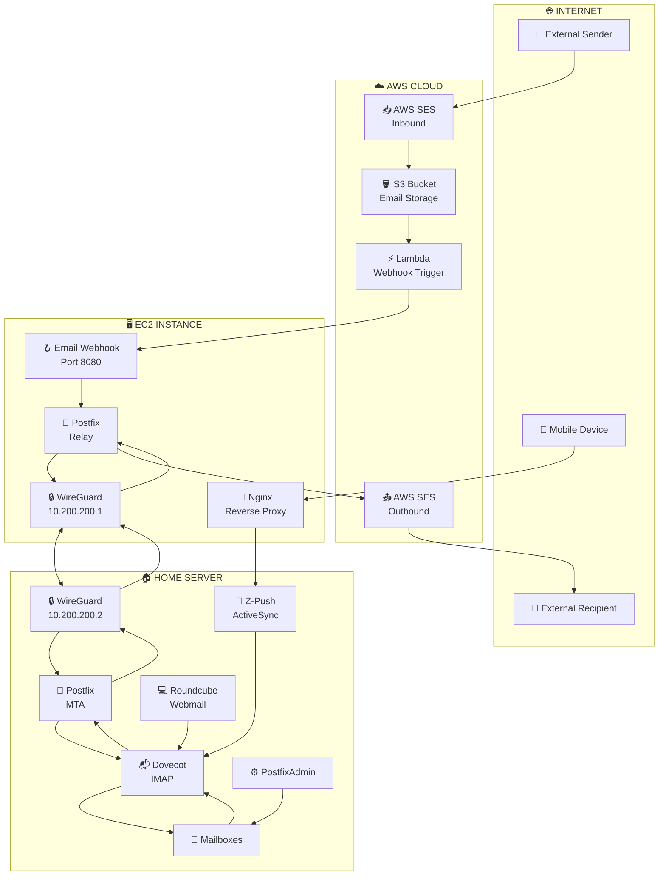
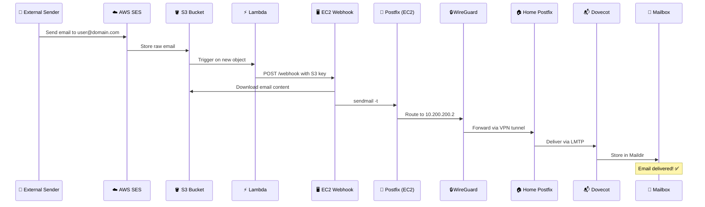
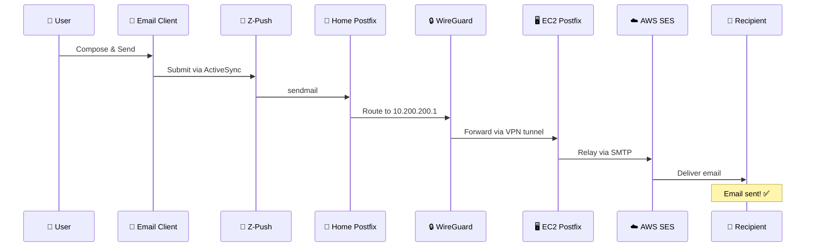
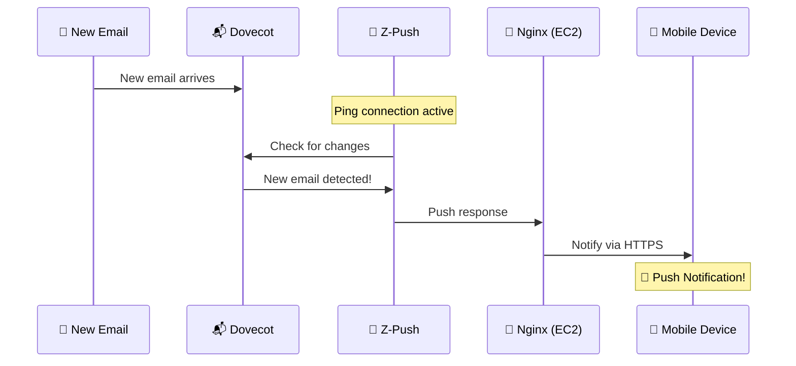
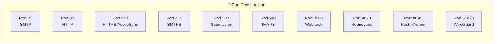

# Complete Email Server Setup Guide
## AWS SES + EC2 Relay + Self-Hosted Mail Server with Z-Push ActiveSync

**Domain:** yourdomain.com  
**Architecture:** Hybrid (AWS SES + EC2 + Home Server via WireGuard VPN)

---

## Table of Contents

1. [Architecture Overview](#architecture-overview)
2. [Prerequisites](#prerequisites)
3. [AWS SES Configuration](#aws-ses-configuration)
4. [EC2 Relay Server Setup](#ec2-relay-server-setup)
5. [WireGuard VPN Setup](#wireguard-vpn-setup)
6. [Home Server Setup](#home-server-setup)
7. [Postfix Configuration](#postfix-configuration)
8. [Dovecot Configuration](#dovecot-configuration)
9. [PostfixAdmin Setup](#postfixadmin-setup)
10. [Roundcube Webmail](#roundcube-webmail)
11. [Z-Push ActiveSync](#z-push-activesync)
12. [SSL Certificates](#ssl-certificates)
13. [Maintenance Scripts](#maintenance-scripts)
14. [Troubleshooting Guide](#troubleshooting-guide)
15. [Cost Breakdown](#cost-breakdown)

---

## Cost Breakdown

### Monthly Costs (Estimated)

| Service | Cost | Notes |
|---------|------|-------|
| **EC2 Instance (t3.micro)** | $0.00 | Free Tier (first 12 months, 750 hrs/month) |
| **EC2 Instance (t3.micro)** | ~$8.50 | After Free Tier expires |
| **EBS Storage (16 GB gp3)** | $0.00 | Free Tier (30 GB free) |
| **AWS SES (Inbound)** | $0.00 | Free (first 1,000 emails) |
| **AWS SES (Outbound)** | $0.10 | Per 1,000 emails sent |
| **S3 Storage** | ~$0.02 | Email storage (minimal) |
| **Lambda** | $0.00 | Free Tier (1M requests/month) |
| **Data Transfer** | ~$0.50 | Varies by usage |
| **Route 53** | $0.00 | Not needed (use Cloudflare) |
| **Elastic IP** | $0.00 | Not needed (use Dynamic DNS) |
| **Cloudflare DNS** | $0.00 | Free plan |
| **Home Server** | $0.00 | Your own hardware + electricity |

### Total Monthly Cost

| Scenario | Cost |
|----------|------|
| **First 12 months (Free Tier)** | **~$0.50 - $2.00/month** |
| **After Free Tier** | **~$9.00 - $12.00/month** |

### Cost Comparison vs Commercial Email Hosting

| Provider | Cost per User/Month | 10 Users/Month |
|----------|---------------------|----------------|
| **This Setup** | **~$0.10 - $1.00** | **~$1 - $10** |
| Google Workspace | $6.00 | $60 |
| Microsoft 365 | $6.00 | $60 |
| Zoho Mail | $1.00 | $10 |
| FastMail | $5.00 | $50 |

> **Savings:** Up to **90%** compared to commercial solutions, with **unlimited mailboxes!**

### Cost Optimization Tips

1. **Use t3.micro** - Stay in Free Tier or minimize costs
2. **Use Cloudflare DNS** - Free, no Route 53 needed
3. **Use Dynamic DNS** - No Elastic IP needed (~$3.60/month saved)
4. **Clean old emails** - Reduce S3 storage costs
5. **Set email retention** - Don't store emails forever

---

## Architecture Overview

### System Architecture Diagram



### Inbound Email Flow



### Outbound Email Flow



### Mobile Push Notification Flow



### Component Diagram



### Services Overview

| Location | Service | Port | Purpose |
|----------|---------|------|---------|
| **EC2** | Nginx | 80, 443 | HTTPS proxy, ActiveSync |
| **EC2** | Postfix | 25 | Mail relay to SES |
| **EC2** | Webhook | 8080 | Receive from Lambda |
| **EC2** | WireGuard | 51820 | VPN tunnel |
| **Home** | Postfix | 25, 587, 465 | Mail delivery |
| **Home** | Dovecot | 143, 993 | IMAP access |
| **Home** | Z-Push | 80 | ActiveSync backend |
| **Home** | Roundcube | 9090 | Webmail |
| **Home** | PostfixAdmin | 9091 | User management |

---


## Prerequisites

### DNS Records (Cloudflare)

| Type | Name | Value | TTL |
|------|------|-------|-----|
| A | mail | EC2_PUBLIC_IP | Auto |
| A | autodiscover | EC2_PUBLIC_IP | Auto |
| A | webmail | HOME_SERVER_IP | Auto |
| A | postfix | HOME_SERVER_IP | Auto |
| MX | @ | inbound-smtp.us-east-1.amazonaws.com | 10 |
| TXT | @ | v=spf1 include:amazonses.com ~all | Auto |
| TXT | _dmarc | v=DMARC1; p=quarantine; rua=mailto:admin@domain.com | Auto |
| CNAME | ses._domainkey | (from AWS SES) | Auto |

### Required Software

**EC2 Instance:**
- Ubuntu 22.04/24.04
- Nginx, Postfix, WireGuard

**Home Server:**
- Ubuntu 22.04
- Postfix, Dovecot, Apache2
- PHP 7.4 (for Z-Push) + PHP 8.1 (for Roundcube/PostfixAdmin)
- SQLite, PostfixAdmin, Roundcube, Z-Push

---

## AWS SES Configuration

### Step 1: Verify Domain

1. AWS Console → SES → Verified Identities → Create Identity
2. Select "Domain" → Enter your domain
3. Enable "Easy DKIM"
4. Add DNS records to Cloudflare

### Step 2: Configure Inbound Email

1. SES → Email Receiving → Create Rule Set
2. Create rule with actions:
   - **Action 1:** Store in S3 bucket (create new: `yourdomain-inbound-email`)
   - **Action 2:** Invoke Lambda function

### Step 3: Create Lambda Function

```python
import json
import urllib.request
import urllib.error

def lambda_handler(event, context):
    # Get S3 object info from SES event
    record = event['Records'][0]
    bucket = record['ses']['receipt']['action']['bucketName']
    key = record['ses']['mail']['messageId']
    
    # Webhook URL (EC2 instance)
    webhook_url = "http://EC2_PUBLIC_IP:8080/webhook"
    
    data = json.dumps({
        'bucket': bucket,
        'key': f"incoming/{key}"
    }).encode('utf-8')
    
    req = urllib.request.Request(
        webhook_url,
        data=data,
        headers={'Content-Type': 'application/json'}
    )
    
    try:
        response = urllib.request.urlopen(req, timeout=30)
        return {'statusCode': 200, 'body': 'Email forwarded'}
    except Exception as e:
        print(f"Error: {e}")
        return {'statusCode': 500, 'body': str(e)}
```

### Step 4: Create SMTP Credentials

1. SES → SMTP Settings → Create SMTP Credentials
2. Save username and password (used on EC2 for outbound relay)

---

## EC2 Relay Server Setup

### Install Required Packages

```bash
sudo apt update
sudo apt install -y nginx postfix libsasl2-modules wireguard python3 python3-pip python3-venv
```

### Configure Postfix

```bash
# /etc/postfix/main.cf
sudo tee /etc/postfix/main.cf << 'EOF'
smtpd_banner = $myhostname ESMTP
biff = no
append_dot_mydstrandom = no
readme_directory = no

myhostname = inbound-smtp.yourdomain.com
mydomain = yourdomain.com
myorigin = $mydomain
mydestination = localhost
mynetworks = 127.0.0.0/8 10.200.200.0/24

# Relay configuration
relayhost = [email-smtp.us-east-1.amazonaws.com]:587
smtp_sasl_auth_enable = yes
smtp_sasl_password_maps = hash:/etc/postfix/sasl_passwd
smtp_sasl_security_options = noanonymous
smtp_tls_security_level = encrypt
smtp_tls_CAfile = /etc/ssl/certs/ca-certificates.crt

# Transport map for local domain
transport_maps = hash:/etc/postfix/transport
EOF

# Create SASL password file
sudo tee /etc/postfix/sasl_passwd << EOF
[email-smtp.us-east-1.amazonaws.com]:587 SES_SMTP_USER:SES_SMTP_PASSWORD
EOF
sudo chmod 600 /etc/postfix/sasl_passwd
sudo postmap /etc/postfix/sasl_passwd

# Create transport map (forward domain emails to home server)
sudo tee /etc/postfix/transport << EOF
yourdomain.com smtp:[10.200.200.2]:25
.yourdomain.com smtp:[10.200.200.2]:25
EOF
sudo postmap /etc/postfix/transport

sudo systemctl restart postfix
```

### Configure Nginx

```bash
# /etc/nginx/sites-available/mail
sudo tee /etc/nginx/sites-available/mail << 'EOF'
# HTTP to HTTPS redirect
server {
    listen 80;
    server_name mail.yourdomain.com;
    return 301 https://$server_name$request_uri;
}

# HTTPS server for ActiveSync
server {
    listen 443 ssl;
    server_name mail.yourdomain.com;

    ssl_certificate /etc/letsencrypt/live/mail.yourdomain.com/fullchain.pem;
    ssl_certificate_key /etc/letsencrypt/live/mail.yourdomain.com/privkey.pem;

    # Z-Push ActiveSync proxy
    location /Microsoft-Server-ActiveSync {
        proxy_pass http://10.200.200.2/Microsoft-Server-ActiveSync;
        proxy_set_header Host $host;
        proxy_set_header X-Real-IP $remote_addr;
        proxy_set_header X-Forwarded-For $proxy_add_x_forwarded_for;
        proxy_read_timeout 3600;
        proxy_connect_timeout 3600;
    }

    location / {
        return 404;
    }
}
EOF

sudo ln -sf /etc/nginx/sites-available/mail /etc/nginx/sites-enabled/
sudo nginx -t && sudo systemctl reload nginx
```

### Configure Nginx Stream (Mail Ports)

```bash
# /etc/nginx/stream.conf
sudo tee /etc/nginx/stream.conf << 'EOF'
stream {
    # IMAP
    server {
        listen 143;
        proxy_pass 10.200.200.2:143;
    }
    
    # IMAPS
    server {
        listen 993;
        proxy_pass 10.200.200.2:993;
    }
    
    # Submission
    server {
        listen 587;
        proxy_pass 10.200.200.2:587;
    }
    
    # SMTPS
    server {
        listen 465;
        proxy_pass 10.200.200.2:465;
    }
}
EOF

# Add to nginx.conf (at the end, outside http block)
echo 'include /etc/nginx/stream.conf;' | sudo tee -a /etc/nginx/nginx.conf
sudo nginx -t && sudo systemctl reload nginx
```

### Setup Email Webhook

```bash
# Create webhook directory
sudo mkdir -p /opt/email-webhook
cd /opt/email-webhook
sudo python3 -m venv venv
source venv/bin/activate
pip install flask gunicorn boto3

# Create webhook app
sudo tee /opt/email-webhook/app.py << 'EOF'
from flask import Flask, request, jsonify
import boto3
import subprocess
import logging

app = Flask(__name__)
logging.basicConfig(level=logging.INFO)

s3 = boto3.client('s3')

@app.route('/webhook', methods=['POST'])
def webhook():
    data = request.json
    bucket = data.get('bucket')
    key = data.get('key')
    
    if not bucket or not key:
        return jsonify({'error': 'Missing bucket or key'}), 400
    
    app.logger.info(f"Processing: s3://{bucket}/{key}")
    
    try:
        # Download email from S3
        response = s3.get_object(Bucket=bucket, Key=key)
        email_content = response['Body'].read()
        
        # Send via Postfix
        process = subprocess.Popen(
            ['/usr/sbin/sendmail', '-t'],
            stdin=subprocess.PIPE,
            stdout=subprocess.PIPE,
            stderr=subprocess.PIPE
        )
        stdout, stderr = process.communicate(input=email_content)
        
        if process.returncode == 0:
            app.logger.info(f"Forwarded: {key}")
            return jsonify({'status': 'forwarded'}), 200
        else:
            app.logger.error(f"Sendmail error: {stderr.decode()}")
            return jsonify({'error': stderr.decode()}), 500
            
    except Exception as e:
        app.logger.error(f"Error: {str(e)}")
        return jsonify({'error': str(e)}), 500

if __name__ == '__main__':
    app.run(host='0.0.0.0', port=8080)
EOF

# Create systemd service
sudo tee /etc/systemd/system/email-webhook.service << 'EOF'
[Unit]
Description=Email Webhook
After=network.target

[Service]
Type=simple
User=ubuntu
WorkingDirectory=/opt/email-webhook
ExecStart=/opt/email-webhook/venv/bin/gunicorn --bind 0.0.0.0:8080 --workers 2 app:app
Restart=always

[Install]
WantedBy=multi-user.target
EOF

sudo systemctl daemon-reload
sudo systemctl enable email-webhook
sudo systemctl start email-webhook
```

---

## WireGuard VPN Setup

### On EC2 (Server)

```bash
# Generate keys
wg genkey | tee /etc/wireguard/privatekey | wg pubkey > /etc/wireguard/publickey

# Create config
sudo tee /etc/wireguard/wg0.conf << 'EOF'
[Interface]
PrivateKey = EC2_PRIVATE_KEY
Address = 10.200.200.1/24
ListenPort = 51820
PostUp = iptables -A FORWARD -i wg0 -j ACCEPT; iptables -t nat -A POSTROUTING -o eth0 -j MASQUERADE
PostDown = iptables -D FORWARD -i wg0 -j ACCEPT; iptables -t nat -D POSTROUTING -o eth0 -j MASQUERADE

[Peer]
PublicKey = HOME_SERVER_PUBLIC_KEY
AllowedIPs = 10.200.200.2/32
EOF

sudo systemctl enable wg-quick@wg0
sudo systemctl start wg-quick@wg0
```

### On Home Server (Client)

```bash
# Generate keys
wg genkey | tee /etc/wireguard/privatekey | wg pubkey > /etc/wireguard/publickey

# Create config
sudo tee /etc/wireguard/wg0.conf << 'EOF'
[Interface]
PrivateKey = HOME_SERVER_PRIVATE_KEY
Address = 10.200.200.2/24

[Peer]
PublicKey = EC2_PUBLIC_KEY
Endpoint = EC2_PUBLIC_IP:51820
AllowedIPs = 10.200.200.1/32
PersistentKeepalive = 25
EOF

sudo systemctl enable wg-quick@wg0
sudo systemctl start wg-quick@wg0
```

### Test Connection

```bash
# From EC2
ping 10.200.200.2

# From Home Server
ping 10.200.200.1
```

---

## Home Server Setup

### Install Required Packages

```bash
sudo apt update
sudo apt install -y postfix postfix-sqlite dovecot-imapd dovecot-lmtpd dovecot-sqlite \
    apache2 libapache2-mod-php php-sqlite3 php-mbstring php-xml php-curl php-gd \
    php-intl php-zip postfixadmin roundcube sqlite3 certbot
```

---

## Postfix Configuration

### Main Configuration

```bash
# /etc/postfix/main.cf
sudo tee /etc/postfix/main.cf << 'EOF'
# Basic settings
smtpd_banner = $myhostname ESMTP
biff = no
append_dot_mydstrandom = no
readme_directory = no

# Host settings
myhostname = mail.yourdomain.com
mydomain = yourdomain.com
myorigin = $mydomain
mydestination = localhost
mynetworks = 127.0.0.0/8 10.200.200.0/24

# Virtual mailbox settings
virtual_mailbox_domains = yourdomain.com
virtual_mailbox_base = /var/mail/vhosts
virtual_mailbox_maps = sqlite:/etc/postfix/sqlite-virtual-mailbox-maps.cf
virtual_alias_maps = sqlite:/etc/postfix/sqlite-virtual-alias-maps.cf
virtual_uid_maps = static:5000
virtual_gid_maps = static:5000

# Relay through EC2
relayhost = [10.200.200.1]:25

# TLS settings
smtpd_tls_cert_file = /etc/letsencrypt/live/mail.yourdomain.com/fullchain.pem
smtpd_tls_key_file = /etc/letsencrypt/live/mail.yourdomain.com/privkey.pem
smtpd_tls_security_level = may
smtp_tls_security_level = may

# SASL authentication
smtpd_sasl_type = dovecot
smtpd_sasl_path = private/auth
smtpd_sasl_auth_enable = yes

# Restrictions
smtpd_recipient_restrictions = permit_mynetworks, permit_sasl_authenticated, reject_unauth_destination
EOF
```

### SQLite Maps

```bash
# Virtual mailbox maps
sudo tee /etc/postfix/sqlite-virtual-mailbox-maps.cf << 'EOF'
dbpath = /var/lib/postfixadmin/postfixadmin.db
query = SELECT maildir FROM mailbox WHERE username='%s' AND active='1'
EOF

# Virtual alias maps
sudo tee /etc/postfix/sqlite-virtual-alias-maps.cf << 'EOF'
dbpath = /var/lib/postfixadmin/postfixadmin.db
query = SELECT goto FROM alias WHERE address='%s' AND active='1'
EOF

sudo chmod 644 /etc/postfix/sqlite-*.cf
```

### Master.cf Configuration

```bash
# Ensure these services are configured in /etc/postfix/master.cf
sudo nano /etc/postfix/master.cf
```

Add/modify:
```
smtp      inet  n       -       y       -       -       smtpd
submission inet n       -       y       -       -       smtpd
  -o syslog_name=postfix/submission
  -o smtpd_tls_security_level=encrypt
  -o smtpd_sasl_auth_enable=yes
  -o smtpd_client_restrictions=permit_sasl_authenticated,reject
smtps     inet  n       -       y       -       -       smtpd
  -o syslog_name=postfix/smtps
  -o smtpd_tls_wrappermode=yes
  -o smtpd_sasl_auth_enable=yes
  -o smtpd_client_restrictions=permit_sasl_authenticated,reject
```

---

## Dovecot Configuration

### Main Configuration

```bash
# /etc/dovecot/dovecot.conf
sudo tee /etc/dovecot/dovecot.conf << 'EOF'
protocols = imap lmtp
listen = *
EOF
```

### Authentication

```bash
# /etc/dovecot/conf.d/10-auth.conf
sudo tee /etc/dovecot/conf.d/10-auth.conf << 'EOF'
disable_plaintext_auth = no
auth_mechanisms = plain login
!include auth-sql.conf.ext
EOF
```

### SQL Authentication

```bash
# /etc/dovecot/dovecot-sql.conf.ext
sudo tee /etc/dovecot/dovecot-sql.conf.ext << 'EOF'
driver = sqlite
connect = /var/lib/postfixadmin/postfixadmin.db
default_pass_scheme = MD5-CRYPT

password_query = SELECT username AS user, password FROM mailbox WHERE username='%u' AND active='1'
user_query = SELECT '/var/mail/vhosts/%d/%n' AS home, 5000 AS uid, 5000 AS gid FROM mailbox WHERE username='%u' AND active='1'
EOF
```

### Mail Location

```bash
# /etc/dovecot/conf.d/10-mail.conf
sudo tee /etc/dovecot/conf.d/10-mail.conf << 'EOF'
mail_location = maildir:/var/mail/vhosts/%d/%n
mail_privileged_group = mail
namespace inbox {
  inbox = yes
}
EOF
```

### SSL Configuration

```bash
# /etc/dovecot/conf.d/10-ssl.conf
sudo tee /etc/dovecot/conf.d/10-ssl.conf << 'EOF'
ssl = required
ssl_cert = </etc/letsencrypt/live/mail.yourdomain.com/fullchain.pem
ssl_key = </etc/letsencrypt/live/mail.yourdomain.com/privkey.pem
ssl_min_protocol = TLSv1.2
EOF
```

### Master Configuration (SASL Socket)

```bash
# /etc/dovecot/conf.d/10-master.conf
# Add Postfix SASL socket
service auth {
  unix_listener /var/spool/postfix/private/auth {
    mode = 0660
    user = postfix
    group = postfix
  }
}
```

### Default Mailboxes

```bash
# /etc/dovecot/conf.d/15-mailboxes.conf
namespace inbox {
  mailbox Drafts {
    special_use = \Drafts
    auto = subscribe
  }
  mailbox Sent {
    special_use = \Sent
    auto = subscribe
  }
  mailbox Trash {
    special_use = \Trash
    auto = subscribe
  }
  mailbox Junk {
    special_use = \Junk
    auto = subscribe
  }
  mailbox Archive {
    special_use = \Archive
    auto = subscribe
  }
}
```

### Create Vmail User

```bash
sudo groupadd -g 5000 vmail
sudo useradd -g vmail -u 5000 vmail -d /var/mail/vhosts -s /sbin/nologin
sudo mkdir -p /var/mail/vhosts
sudo chown -R vmail:vmail /var/mail/vhosts
```

---

## PostfixAdmin Setup

### Configure Database

```bash
# /etc/postfixadmin/config.local.php
sudo tee /etc/postfixadmin/config.local.php << 'EOF'
<?php
$CONF['configured'] = true;
$CONF['database_type'] = 'sqlite';
$CONF['database_name'] = '/var/lib/postfixadmin/postfixadmin.db';
$CONF['setup_password'] = 'YOUR_HASHED_PASSWORD';

$CONF['encrypt'] = 'md5crypt';
$CONF['default_aliases'] = array();
$CONF['domain_path'] = 'YES';
$CONF['domain_in_mailbox'] = 'NO';

$CONF['admin_email'] = 'it@yourdomain.com';
$CONF['smtp_server'] = 'localhost';
$CONF['smtp_port'] = '25';

$CONF['welcome_text'] = <<<EOM
Hello!

Welcome to your new email account at Your Company.

Best regards,
IT Team
EOM;
EOF

# Setup database
sudo mkdir -p /var/lib/postfixadmin
sudo touch /var/lib/postfixadmin/postfixadmin.db
sudo chown -R www-data:www-data /var/lib/postfixadmin
sudo chmod 664 /var/lib/postfixadmin/postfixadmin.db
```

### Apache Virtual Host

```bash
# /etc/apache2/sites-available/postfixadmin.conf
sudo tee /etc/apache2/sites-available/postfixadmin.conf << 'EOF'
<VirtualHost *:9091>
    ServerName postfix.yourdomain.com
    DocumentRoot /usr/share/postfixadmin/public
    
    <Directory /usr/share/postfixadmin/public>
        Options -Indexes +FollowSymLinks
        AllowOverride All
        Require all granted
    </Directory>
</VirtualHost>
EOF

echo "Listen 9091" | sudo tee -a /etc/apache2/ports.conf
sudo a2ensite postfixadmin.conf
sudo systemctl reload apache2
```

---

## Roundcube Webmail

### Apache Virtual Host

```bash
# /etc/apache2/sites-available/roundcube.conf
sudo tee /etc/apache2/sites-available/roundcube.conf << 'EOF'
<VirtualHost *:9090>
    ServerName webmail.yourdomain.com
    DocumentRoot /var/www/html/roundcube
    
    <Directory /var/www/html/roundcube>
        Options -Indexes +FollowSymLinks
        AllowOverride All
        Require all granted
    </Directory>
</VirtualHost>
EOF

echo "Listen 9090" | sudo tee -a /etc/apache2/ports.conf
sudo a2ensite roundcube.conf
sudo systemctl reload apache2
```

### Configuration

```bash
# /var/www/html/roundcube/config/config.inc.php
$config['db_dsnw'] = 'sqlite:////var/lib/roundcube/roundcube.db';
$config['imap_host'] = 'localhost:143';
$config['smtp_host'] = 'localhost:587';
$config['smtp_user'] = '%u';
$config['smtp_pass'] = '%p';
$config['support_url'] = '';
$config['product_name'] = 'Your Company Webmail';
$config['plugins'] = array('archive', 'zipdownload');
$config['drafts_mbox'] = 'Drafts';
$config['sent_mbox'] = 'Sent';
$config['trash_mbox'] = 'Trash';
$config['junk_mbox'] = 'Junk';
```

---

## Z-Push ActiveSync

### Installation

> **IMPORTANT:** Z-Push is NOT compatible with PHP 8. You MUST use PHP 7.4.

```bash
# Install PHP 7.4
sudo add-apt-repository ppa:ondrej/php -y
sudo apt update
sudo apt install -y php7.4 php7.4-fpm php7.4-imap php7.4-mbstring php7.4-soap php7.4-xml php7.4-sqlite3

# Install Z-Push from apt
sudo apt install -y z-push z-push-backend-imap z-push-common
```

### Configuration

```bash
# /etc/z-push/z-push.conf.php
sudo nano /etc/z-push/z-push.conf.php
```

Set:
```php
define('TIMEZONE', 'Asia/Kolkata');
define('BACKEND_PROVIDER', 'BackendIMAP');
define('USE_FULLEMAIL_FOR_LOGIN', true);
```

```bash
# /etc/z-push/imap.conf.php
sudo nano /etc/z-push/imap.conf.php
```

Set:
```php
define('IMAP_SERVER', 'localhost');
define('IMAP_PORT', 143);
define('IMAP_OPTIONS', '/notls/novalidate-cert');
define('IMAP_FOLDER_INBOX', 'INBOX');
define('IMAP_FOLDER_SENT', 'Sent');
define('IMAP_FOLDER_DRAFT', 'Drafts');
define('IMAP_FOLDER_TRASH', 'Trash');
define('IMAP_FOLDER_SPAM', 'Junk');
define('IMAP_FOLDER_ARCHIVE', 'Archive');
define('IMAP_SMTP_METHOD', 'sendmail');
define('IMAP_FOLDER_CONFIGURED', true);
```

### Apache Configuration

```bash
# /etc/apache2/conf-available/z-push.conf
# Add this line at the end for PHP-FPM auth header pass-through
echo 'SetEnvIf Authorization "(.*)" HTTP_AUTHORIZATION=$1' | sudo tee -a /etc/apache2/conf-available/z-push.conf

sudo a2enconf z-push
sudo systemctl restart apache2
```

### Test Z-Push

```bash
curl -v -u "user@yourdomain.com:password" http://localhost/Microsoft-Server-ActiveSync
# Should return HTTP 200 with "GET not supported" message
```

---

## SSL Certificates

### Using Certbot with Cloudflare DNS

```bash
# Install Certbot
sudo apt install -y certbot python3-certbot-dns-cloudflare

# Create Cloudflare credentials
sudo tee /etc/letsencrypt/cloudflare.ini << 'EOF'
dns_cloudflare_api_token = YOUR_CLOUDFLARE_API_TOKEN
EOF
sudo chmod 600 /etc/letsencrypt/cloudflare.ini

# Get certificate
sudo certbot certonly --dns-cloudflare \
    --dns-cloudflare-credentials /etc/letsencrypt/cloudflare.ini \
    -d mail.yourdomain.com

# Auto-renewal
sudo certbot renew --dry-run
```

---

## Maintenance Scripts

### Health Check Script

```bash
# /usr/local/bin/mail-health-check.sh
sudo tee /usr/local/bin/mail-health-check.sh << 'EOF'
#!/bin/bash
LOG="/var/log/mail-health.log"
DATE=$(date '+%Y-%m-%d %H:%M:%S')

# Check services
for SERVICE in postfix dovecot apache2; do
    if ! systemctl is-active --quiet $SERVICE; then
        echo "$DATE - $SERVICE is down, restarting..." >> $LOG
        systemctl restart $SERVICE
    fi
done

# Check WireGuard
if ! ping -c 1 10.200.200.1 &>/dev/null; then
    echo "$DATE - WireGuard down, restarting..." >> $LOG
    systemctl restart wg-quick@wg0
fi

# Check SQLite database
if ! sqlite3 /var/lib/postfixadmin/postfixadmin.db "SELECT 1" 2>/dev/null; then
    echo "$DATE - SQLite database locked, clearing..." >> $LOG
    rm -f /var/lib/postfixadmin/postfixadmin.db-wal
    rm -f /var/lib/postfixadmin/postfixadmin.db-shm
    systemctl restart postfix
fi
EOF

sudo chmod +x /usr/local/bin/mail-health-check.sh
echo "*/5 * * * * root /usr/local/bin/mail-health-check.sh" | sudo tee /etc/cron.d/mail-health
```

### Backup Script

```bash
# /usr/local/bin/mail-backup.sh
sudo tee /usr/local/bin/mail-backup.sh << 'EOF'
#!/bin/bash
BACKUP_DIR="/var/backups/mail"
DATE=$(date +%Y%m%d)
RETENTION=7

mkdir -p $BACKUP_DIR

# Backup mailboxes
tar -czf $BACKUP_DIR/mailboxes-$DATE.tar.gz /var/mail/vhosts/

# Backup databases
cp /var/lib/postfixadmin/postfixadmin.db $BACKUP_DIR/postfixadmin-$DATE.db
cp /var/lib/roundcube/roundcube.db $BACKUP_DIR/roundcube-$DATE.db 2>/dev/null

# Backup configs
tar -czf $BACKUP_DIR/configs-$DATE.tar.gz /etc/postfix /etc/dovecot /etc/z-push

# Remove old backups
find $BACKUP_DIR -type f -mtime +$RETENTION -delete

echo "$(date) - Backup completed" >> /var/log/mail-backup.log
EOF

sudo chmod +x /usr/local/bin/mail-backup.sh
echo "0 2 * * * root /usr/local/bin/mail-backup.sh" | sudo tee /etc/cron.d/mail-backup
```

### Welcome Email Script

```bash
# /usr/local/bin/watch-new-users.sh
sudo tee /usr/local/bin/watch-new-users.sh << 'EOF'
#!/bin/bash
DB="/var/lib/postfixadmin/postfixadmin.db"
SENT_FILE="/var/lib/postfixadmin/welcome_sent.txt"
DEFAULT_PASSWORD="NewUserLogin2026"
FROM_EMAIL="it@yourdomain.com"

touch "$SENT_FILE"

sqlite3 "$DB" "SELECT username, email_other FROM mailbox WHERE active='1'" | while IFS='|' read email alt_email; do
    if ! grep -q "^$email$" "$SENT_FILE"; then
        for SEND_TO in "$email" "$alt_email"; do
            if [ -n "$SEND_TO" ]; then
                cat << MAIL | /usr/sbin/sendmail -t -f $FROM_EMAIL
To: $SEND_TO
From: IT Team <$FROM_EMAIL>
Subject: Welcome to Your Company Email

Hello!

Your email account has been created.

Login Details:
- Email: $email
- Temporary Password: $DEFAULT_PASSWORD

Please change your password immediately at:
http://postfix.yourdomain.com:9091/users/

Best regards,
IT Team
MAIL
            fi
        done
        echo "$email" >> "$SENT_FILE"
    fi
done
EOF

sudo chmod +x /usr/local/bin/watch-new-users.sh
echo "*/5 * * * * root /usr/local/bin/watch-new-users.sh" | sudo tee /etc/cron.d/welcome-mail
```

---

## Troubleshooting Guide

### Problem: "lost connection while sending MAIL FROM"

**Cause:** Home server Postfix can't read SQLite database (I/O error)

**Solution:**
```bash
# Stop services holding the lock
sudo systemctl stop apache2

# Clear lock files
sudo rm -f /var/lib/postfixadmin/postfixadmin.db-journal
sudo rm -f /var/lib/postfixadmin/postfixadmin.db-wal
sudo rm -f /var/lib/postfixadmin/postfixadmin.db-shm

# Fix journal mode
sudo sqlite3 /var/lib/postfixadmin/postfixadmin.db "PRAGMA journal_mode=DELETE;"

# Fix permissions
sudo chown www-data:postfix /var/lib/postfixadmin/postfixadmin.db
sudo chmod 664 /var/lib/postfixadmin/postfixadmin.db

# Restart
sudo systemctl start apache2
sudo systemctl restart postfix
```

---

### Problem: Z-Push returns 500 Internal Server Error

**Cause:** PHP 8 incompatibility or missing config

**Solution:**
1. Use PHP 7.4 for Z-Push:
```bash
sudo apt install php7.4 php7.4-fpm php7.4-imap php7.4-sqlite3 php7.4-xml
```

2. Add auth header fix:
```bash
echo 'SetEnvIf Authorization "(.*)" HTTP_AUTHORIZATION=$1' | sudo tee -a /etc/apache2/conf-available/z-push.conf
sudo systemctl restart apache2
```

---

### Problem: Z-Push authentication fails (Username or password incorrect)

**Cause:** Certificate hostname mismatch when connecting to localhost

**Solution:**
Edit `/etc/z-push/imap.conf.php`:
```php
define('IMAP_SERVER', 'localhost');
define('IMAP_PORT', 143);
define('IMAP_OPTIONS', '/notls/novalidate-cert');
```

---

### Problem: Roundcube/PostfixAdmin show "Internal Error" after Z-Push setup

**Cause:** PHP-FPM using PHP 7.4 which lacks SQLite driver

**Solution:**
```bash
sudo apt install php7.4-sqlite3
sudo systemctl restart php7.4-fpm
sudo systemctl restart apache2
```

---

### Problem: Mobile app can't connect ("Can't reach server")

**Cause:** App requires HTTPS, or EC2 proxy not configured

**Solution:**
1. Ensure SSL is configured on EC2:
```bash
sudo certbot --nginx -d mail.yourdomain.com
```

2. Add ActiveSync proxy to Nginx HTTPS block:
```nginx
location /Microsoft-Server-ActiveSync {
    proxy_pass http://10.200.200.2/Microsoft-Server-ActiveSync;
    proxy_set_header Host $host;
    proxy_read_timeout 3600;
}
```

---

### Problem: Emails not being received (inbound)

**Cause:** Lambda not triggering, S3 not accessible, or Postfix transport issue

**Solution:**
1. Check Lambda CloudWatch logs
2. Check EC2 webhook: `sudo journalctl -u email-webhook -n 30`
3. Check EC2 Postfix queue: `mailq`
4. Check home server logs: `sudo tail -f /var/log/syslog | grep postfix`

---

### Problem: Emails going to spam

**Cause:** Missing SPF, DKIM, or DMARC records

**Solution:**
1. Verify DNS records in Cloudflare
2. Test with mail-tester.com
3. Ensure SES domain is verified with DKIM enabled

---

### Problem: WireGuard connection drops

**Cause:** NAT timeout or missing keepalive

**Solution:**
Add to home server WireGuard config:
```
PersistentKeepalive = 25
```

---

## Quick Reference

### Service Commands

```bash
# Postfix
sudo systemctl restart postfix
sudo postqueue -p          # View queue
sudo postqueue -f          # Flush queue

# Dovecot
sudo systemctl restart dovecot
doveadm user user@domain   # Check user

# Apache
sudo systemctl restart apache2
sudo apache2ctl configtest

# Z-Push
z-push-admin -a list       # List devices

# WireGuard
sudo wg show               # Show status
sudo systemctl restart wg-quick@wg0
```

### Log Locations

| Service | Log File |
|---------|----------|
| Postfix | `/var/log/syslog` or `journalctl -u postfix` |
| Dovecot | `/var/log/syslog` or `journalctl -u dovecot` |
| Apache | `/var/log/apache2/error.log` |
| Z-Push | `/var/log/z-push/z-push-error.log` |
| WireGuard | `journalctl -u wg-quick@wg0` |

### Ports Used

| Port | Service | Location |
|------|---------|----------|
| 25 | SMTP | EC2 → Home |
| 143 | IMAP | Home Server |
| 465 | SMTPS | External → EC2 → Home |
| 587 | Submission | External → EC2 → Home |
| 993 | IMAPS | External → EC2 → Home |
| 8080 | Webhook | EC2 |
| 9090 | Roundcube | Home Server |
| 9091 | PostfixAdmin | Home Server |
| 51820 | WireGuard | EC2 ↔ Home |

---

## Mobile App Configuration

### Gmail/Outlook (Exchange/ActiveSync)

| Setting | Value |
|---------|-------|
| Server | mail.yourdomain.com |
| Port | 443 |
| Security | SSL/TLS |
| Username | Full email address |

### IMAP/SMTP (K-9 Mail, etc.)

| Setting | Value |
|---------|-------|
| IMAP Server | mail.yourdomain.com |
| IMAP Port | 993 (SSL/TLS) |
| SMTP Server | mail.yourdomain.com |
| SMTP Port | 465 (SSL/TLS) |
| Username | Full email address |

---

---

## Sender Name Enforcement

Ensure all outgoing emails include the registered display name from PostfixAdmin.

### Create Header Rewrite Script

```bash
sudo tee /usr/local/bin/update-header-checks.sh << 'SCRIPT'
#!/bin/bash
DB="/var/lib/postfixadmin/postfixadmin.db"
OUTPUT="/etc/postfix/header_checks"

echo "# Auto-generated From header rewrite - $(date)" > $OUTPUT

sqlite3 "$DB" "SELECT username, name FROM mailbox WHERE active='1' AND name != ''" | while IFS='|' read email name; do
    if [ -n "$name" ] && [ -n "$email" ]; then
        escaped_email=$(echo "$email" | sed 's/[.]/\\./g')
        echo "/^From:.*<${escaped_email}>/ REPLACE From: \"${name}\" <${email}>" >> $OUTPUT
        echo "/^From: ${escaped_email}$/ REPLACE From: \"${name}\" <${email}>" >> $OUTPUT
    fi
done

echo "Updated header checks at $(date)"
SCRIPT

sudo chmod +x /usr/local/bin/update-header-checks.sh
sudo /usr/local/bin/update-header-checks.sh
```

### Configure Postfix

```bash
sudo postconf -e "header_checks = regexp:/etc/postfix/header_checks"
sudo postconf -e "smtpd_header_restrictions = regexp:/etc/postfix/header_checks"
sudo systemctl restart postfix
```

### Schedule Auto-Update for New Users

```bash
echo "0 * * * * root /usr/local/bin/update-header-checks.sh" | sudo tee /etc/cron.d/header-checks
```

---

## Full System Backup & Restore

### Backup Script (Home Server)

```bash
sudo tee /usr/local/bin/full-system-backup.sh << 'EOF'
#!/bin/bash
#===============================================================================
# Full Email System Backup Script
#===============================================================================

set -e

BACKUP_DIR="/var/backups/mail-system"
DATE=$(date +%Y%m%d_%H%M%S)
BACKUP_NAME="mail-system-backup-$DATE"
BACKUP_PATH="$BACKUP_DIR/$BACKUP_NAME"

echo "=========================================="
echo "  Email System Full Backup"
echo "  Date: $(date)"
echo "=========================================="

mkdir -p "$BACKUP_PATH"

echo "[1/8] Backing up Postfix..."
mkdir -p "$BACKUP_PATH/postfix"
cp -r /etc/postfix/* "$BACKUP_PATH/postfix/"

echo "[2/8] Backing up Dovecot..."
mkdir -p "$BACKUP_PATH/dovecot"
cp -r /etc/dovecot/* "$BACKUP_PATH/dovecot/"

echo "[3/8] Backing up Apache..."
mkdir -p "$BACKUP_PATH/apache2"
cp -r /etc/apache2/sites-available/* "$BACKUP_PATH/apache2/"
cp /etc/apache2/ports.conf "$BACKUP_PATH/apache2/"
cp -r /etc/apache2/conf-available/z-push*.conf "$BACKUP_PATH/apache2/" 2>/dev/null || true

echo "[4/8] Backing up Z-Push..."
mkdir -p "$BACKUP_PATH/z-push"
cp -r /etc/z-push/* "$BACKUP_PATH/z-push/"

echo "[5/8] Backing up PostfixAdmin..."
mkdir -p "$BACKUP_PATH/postfixadmin"
cp /etc/postfixadmin/config.local.php "$BACKUP_PATH/postfixadmin/"
cp /var/lib/postfixadmin/postfixadmin.db "$BACKUP_PATH/postfixadmin/"

echo "[6/8] Backing up Roundcube..."
mkdir -p "$BACKUP_PATH/roundcube"
cp /var/www/html/roundcube/config/config.inc.php "$BACKUP_PATH/roundcube/" 2>/dev/null || true
cp /var/lib/roundcube/roundcube.db "$BACKUP_PATH/roundcube/" 2>/dev/null || true

echo "[7/8] Backing up WireGuard..."
mkdir -p "$BACKUP_PATH/wireguard"
cp /etc/wireguard/wg0.conf "$BACKUP_PATH/wireguard/"

echo "[8/8] Backing up scripts and cron jobs..."
mkdir -p "$BACKUP_PATH/scripts"
cp /usr/local/bin/mail-*.sh "$BACKUP_PATH/scripts/" 2>/dev/null || true
cp /usr/local/bin/update-*.sh "$BACKUP_PATH/scripts/" 2>/dev/null || true
cp /usr/local/bin/watch-*.sh "$BACKUP_PATH/scripts/" 2>/dev/null || true
mkdir -p "$BACKUP_PATH/cron"
cp /etc/cron.d/mail-* "$BACKUP_PATH/cron/" 2>/dev/null || true
cp /etc/cron.d/welcome-* "$BACKUP_PATH/cron/" 2>/dev/null || true
cp /etc/cron.d/header-* "$BACKUP_PATH/cron/" 2>/dev/null || true

# Backup SSL certificates
if [ -d "/etc/letsencrypt/live" ]; then
    mkdir -p "$BACKUP_PATH/ssl"
    cp -rL /etc/letsencrypt/live/* "$BACKUP_PATH/ssl/" 2>/dev/null || true
fi

# Create restore script
cat > "$BACKUP_PATH/restore-system.sh" << 'RESTORE'
#!/bin/bash
echo "WARNING: This will overwrite existing configurations!"
echo "Press Ctrl+C to cancel, or Enter to continue..."
read

SCRIPT_DIR="$(cd "$(dirname "$0")" && pwd)"

cp -r "$SCRIPT_DIR/postfix/"* /etc/postfix/
cp -r "$SCRIPT_DIR/dovecot/"* /etc/dovecot/
cp "$SCRIPT_DIR/apache2/"*.conf /etc/apache2/sites-available/
cp "$SCRIPT_DIR/apache2/ports.conf" /etc/apache2/
cp -r "$SCRIPT_DIR/z-push/"* /etc/z-push/
cp "$SCRIPT_DIR/postfixadmin/config.local.php" /etc/postfixadmin/
cp "$SCRIPT_DIR/postfixadmin/postfixadmin.db" /var/lib/postfixadmin/
chown www-data:www-data /var/lib/postfixadmin/postfixadmin.db
chmod 664 /var/lib/postfixadmin/postfixadmin.db
cp "$SCRIPT_DIR/wireguard/wg0.conf" /etc/wireguard/
chmod 600 /etc/wireguard/wg0.conf
cp "$SCRIPT_DIR/scripts/"*.sh /usr/local/bin/ 2>/dev/null || true
chmod +x /usr/local/bin/*.sh
cp "$SCRIPT_DIR/cron/"* /etc/cron.d/ 2>/dev/null || true

systemctl restart postfix dovecot apache2 php7.4-fpm wg-quick@wg0
echo "Restore Complete!"
RESTORE
chmod +x "$BACKUP_PATH/restore-system.sh"

# Compress
cd "$BACKUP_DIR"
tar -czf "$BACKUP_NAME.tar.gz" "$BACKUP_NAME"
rm -rf "$BACKUP_PATH"

# Copy to user home
USER_BACKUP="/home/ns1/backups"
mkdir -p "$USER_BACKUP"
cp "$BACKUP_DIR/$BACKUP_NAME.tar.gz" "$USER_BACKUP/"
chown ns1:ns1 "$USER_BACKUP/$BACKUP_NAME.tar.gz"

echo "Backup saved to: $USER_BACKUP/$BACKUP_NAME.tar.gz"
EOF

sudo chmod +x /usr/local/bin/full-system-backup.sh
```

### Run Backup

```bash
sudo /usr/local/bin/full-system-backup.sh
```

### Restore on New Server

```bash
# 1. Install required packages first (postfix, dovecot, apache2, z-push, etc.)

# 2. Extract backup
tar -xzf mail-system-backup-XXXXXXXX.tar.gz
cd mail-system-backup-XXXXXXXX

# 3. Run restore
sudo ./restore-system.sh
```

### What Gets Backed Up

| Component | Location | Includes |
|-----------|----------|----------|
| Postfix | `/etc/postfix/` | All configs, maps, transport |
| Dovecot | `/etc/dovecot/` | Auth, SSL, mailbox configs |
| Apache | `/etc/apache2/` | Virtual hosts, ports |
| Z-Push | `/etc/z-push/` | IMAP backend config |
| PostfixAdmin | DB + config | Users, passwords, aliases |
| Roundcube | DB + config | User settings |
| WireGuard | `/etc/wireguard/` | VPN configuration |
| Scripts | `/usr/local/bin/` | All maintenance scripts |
| Cron Jobs | `/etc/cron.d/` | Scheduled tasks |
| SSL Certs | `/etc/letsencrypt/` | Certificates & keys |

---

## Service Auto-Start Verification

Ensure all services start on boot:

```bash
# Check status
sudo systemctl is-enabled postfix dovecot apache2 php7.4-fpm wg-quick@wg0

# Enable if needed
sudo systemctl enable postfix dovecot apache2 php7.4-fpm wg-quick@wg0
```

---

*Guide created: December 2025*  
*Last updated: December 24, 2025*
