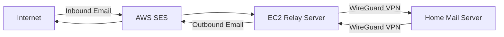

# AWS SES Business Email Setup Guide

Complete guide to set up business email using AWS SES, EC2 relay, and home mail server connected via WireGuard VPN.

## Architecture Overview



**Inbound Flow:** Internet → AWS SES → EC2 → WireGuard → Home Server  
**Outbound Flow:** Home Server → WireGuard → EC2 → AWS SES → Internet

---

## Prerequisites

- [ ] AWS Account with billing enabled
- [ ] Domain name (e.g., yourbusiness.com)
- [ ] Home server with Ubuntu/Debian (or similar)
- [ ] Static IP or dynamic DNS for home server (for VPN)
- [ ] Basic knowledge of Linux command line

---

## Phase 1: AWS SES Domain Setup

### Step 1.1: Verify Your Domain in SES

1. **Login to AWS Console** → Navigate to **Amazon SES**
2. **Select Region** (choose closest to you, e.g., `us-east-1`, `eu-west-1`)
3. Go to **Configuration** → **Verified Identities** → **Create Identity**
4. Select **Domain** and enter your domain name
5. Choose **Easy DKIM** (recommended)
6. Click **Create Identity**

### Step 1.2: Add DNS Records

AWS will provide DNS records to add to your domain registrar:

| Type | Name | Value |
|------|------|-------|
| TXT | _amazonses.yourbusiness.com | (verification token) |
| CNAME | xxx._domainkey.yourbusiness.com | xxx.dkim.amazonses.com |
| CNAME | yyy._domainkey.yourbusiness.com | yyy.dkim.amazonses.com |
| CNAME | zzz._domainkey.yourbusiness.com | zzz.dkim.amazonses.com |

**Add these records:**
```
# Example for Cloudflare/your DNS provider
Type: TXT
Name: _amazonses
Value: <provided-token>

Type: CNAME
Name: <selector1>._domainkey
Value: <selector1>.dkim.amazonses.com

# Repeat for all 3 DKIM records
```

### Step 1.3: Add MX Record

Point your domain's MX record to SES inbound endpoint:

```
Type: MX
Name: @
Priority: 10
Value: inbound-smtp.<region>.amazonaws.com
```

Replace `<region>` with your SES region (e.g., `us-east-1`).

### Step 1.4: Request Production Access

1. In SES Console → **Account Dashboard**
2. Click **Request production access**
3. Fill out the form:
   - **Mail type:** Transactional
   - **Website URL:** Your business website
   - **Use case description:** Business email for company communications
   - **Compliance:** Confirm you'll handle bounces/complaints
4. Submit and wait for approval (usually 24-48 hours)

---

## Phase 2: EC2 Instance Setup

### Step 2.1: Launch EC2 Instance

1. **Go to EC2 Console** → **Launch Instance**
2. **Configuration:**
   - **Name:** `email-relay-server`
   - **AMI:** Ubuntu Server 22.04 LTS
   - **Instance Type:** `t3.micro` (sufficient for email relay)
   - **Key Pair:** Create new or use existing
   - **Network Settings:**
     - Auto-assign public IP: **Yes**
     - Create security group with these rules:

| Type | Protocol | Port | Source | Description |
|------|----------|------|--------|-------------|
| SSH | TCP | 22 | Your IP | SSH access |
| SMTP | TCP | 25 | 0.0.0.0/0 | Inbound email from SES |
| Custom TCP | TCP | 587 | 0.0.0.0/0 | Submission port |
| Custom UDP | UDP | 51820 | Your Home IP | WireGuard VPN |

3. **Storage:** 8 GB (default is fine)
4. **Launch Instance**

### Step 2.2: Allocate Elastic IP

1. **EC2 Console** → **Elastic IPs** → **Allocate Elastic IP**
2. **Associate** the Elastic IP with your `email-relay-server` instance
3. **Note down this IP** - you'll need it for DNS and WireGuard

### Step 2.3: Connect to EC2 Instance

```bash
ssh -i your-key.pem ubuntu@<elastic-ip>
```

### Step 2.4: Update System

```bash
sudo apt update && sudo apt upgrade -y
sudo apt install -y postfix postfix-pcre wireguard wireguard-tools net-tools
```

When prompted during Postfix installation:
- **General type:** Internet Site
- **System mail name:** yourbusiness.com

---

## Phase 3: WireGuard VPN Setup

### Step 3.1: Generate Keys on EC2

```bash
# On EC2 instance
cd /etc/wireguard
sudo su
umask 077

# Generate EC2 keys
wg genkey | tee ec2-private.key | wg pubkey > ec2-public.key

# Display keys (save these)
echo "EC2 Private Key:"
cat ec2-private.key
echo "EC2 Public Key:"
cat ec2-public.key
```

### Step 3.2: Generate Keys on Home Server

```bash
# On your home server
sudo apt install -y wireguard wireguard-tools
cd /etc/wireguard
sudo su
umask 077

# Generate home server keys
wg genkey | tee home-private.key | wg pubkey > home-public.key

# Display keys (save these)
echo "Home Private Key:"
cat home-private.key
echo "Home Public Key:"
cat home-public.key
```

### Step 3.3: Configure WireGuard on EC2

Create `/etc/wireguard/wg0.conf` on EC2:

```ini
[Interface]
Address = 10.200.200.1/24
ListenPort = 51820
PrivateKey = <EC2-PRIVATE-KEY>

# Enable IP forwarding
PostUp = sysctl -w net.ipv4.ip_forward=1
PostDown = sysctl -w net.ipv4.ip_forward=0

[Peer]
# Home Server
PublicKey = <HOME-PUBLIC-KEY>
AllowedIPs = 10.200.200.2/32
PersistentKeepalive = 25
```

**Enable and start WireGuard:**

```bash
sudo systemctl enable wg-quick@wg0
sudo systemctl start wg-quick@wg0
sudo systemctl status wg-quick@wg0
```

### Step 3.4: Configure WireGuard on Home Server

Create `/etc/wireguard/wg0.conf` on home server:

```ini
[Interface]
Address = 10.200.200.2/24
PrivateKey = <HOME-PRIVATE-KEY>

# Auto-reconnect script
PostUp = /etc/wireguard/check-connection.sh

[Peer]
# EC2 Server
PublicKey = <EC2-PUBLIC-KEY>
Endpoint = <EC2-ELASTIC-IP>:51820
AllowedIPs = 10.200.200.1/32
PersistentKeepalive = 25
```

**Enable and start WireGuard:**

```bash
sudo systemctl enable wg-quick@wg0
sudo systemctl start wg-quick@wg0
sudo systemctl status wg-quick@wg0
```

### Step 3.5: Test VPN Connection

```bash
# From EC2, ping home server
ping 10.200.200.2

# From home server, ping EC2
ping 10.200.200.1
```

Both should respond successfully.

---

## Phase 4: Postfix Configuration on EC2

### Step 4.1: Configure Postfix as Relay

Edit `/etc/postfix/main.cf` on EC2:

```bash
sudo nano /etc/postfix/main.cf
```

**Add/modify these settings:**

```conf
# Basic settings
myhostname = mail.yourbusiness.com
mydomain = yourbusiness.com
myorigin = $mydomain
mydestination = localhost

# Network settings
inet_interfaces = all
inet_protocols = ipv4

# Relay settings - accept from SES and home server
mynetworks = 127.0.0.0/8, 10.200.200.0/24, <SES-IP-RANGES>
relay_domains = $mydomain

# Forward incoming mail to home server via WireGuard
transport_maps = hash:/etc/postfix/transport

# Outbound via SES SMTP
relayhost = [email-smtp.<region>.amazonaws.com]:587
smtp_sasl_auth_enable = yes
smtp_sasl_security_options = noanonymous
smtp_sasl_password_maps = hash:/etc/postfix/sasl_passwd
smtp_use_tls = yes
smtp_tls_security_level = encrypt
smtp_tls_note_starttls_offer = yes

# Size limits
message_size_limit = 40960000
```

> [!IMPORTANT]
> Replace `<region>` with your SES region (e.g., `us-east-1`)

### Step 4.2: Get SES SMTP Credentials

1. **SES Console** → **SMTP Settings** → **Create SMTP Credentials**
2. Download and save the credentials (username and password)

### Step 4.3: Configure SES SMTP Authentication

Create `/etc/postfix/sasl_passwd`:

```bash
sudo nano /etc/postfix/sasl_passwd
```

Add:

```
[email-smtp.<region>.amazonaws.com]:587 SMTP_USERNAME:SMTP_PASSWORD
```

**Secure and hash the file:**

```bash
sudo chmod 600 /etc/postfix/sasl_passwd
sudo postmap /etc/postfix/sasl_passwd
```

### Step 4.4: Configure Transport Map

Create `/etc/postfix/transport`:

```bash
sudo nano /etc/postfix/transport
```

Add:

```
yourbusiness.com smtp:[10.200.200.2]:25
.yourbusiness.com smtp:[10.200.200.2]:25
```

**Hash the transport file:**

```bash
sudo postmap /etc/postfix/transport
```

### Step 4.5: Restart Postfix

```bash
sudo systemctl restart postfix
sudo systemctl status postfix
```

---

## Phase 5: Home Mail Server Setup

### Step 5.1: Install Mail Server Software

I recommend **Mail-in-a-Box** for easy setup, or manual **Postfix + Dovecot**.

#### Option A: Mail-in-a-Box (Recommended for beginners)

```bash
# On home server
curl -s https://mailinabox.email/setup.sh | sudo bash
```

Follow the interactive setup:
- **Email address:** admin@yourbusiness.com
- **Hostname:** mail.yourbusiness.com (use internal hostname)
- **Country/Timezone:** Your location

#### Option B: Manual Postfix + Dovecot

```bash
sudo apt install -y postfix dovecot-core dovecot-imapd dovecot-pop3d
```

**Configure Postfix** (`/etc/postfix/main.cf`):

```conf
myhostname = mail.local.yourbusiness.com
mydomain = yourbusiness.com
myorigin = $mydomain
mydestination = $mydomain, localhost
mynetworks = 127.0.0.0/8, 10.200.200.0/24
inet_interfaces = all

# Mailbox settings
home_mailbox = Maildir/
mailbox_command =

# SMTP relay via EC2 for outbound
relayhost = [10.200.200.1]:25
```

### Step 5.2: Configure Outbound Relay

Your home server should send all outbound mail to EC2:

In `/etc/postfix/main.cf`:

```conf
relayhost = [10.200.200.1]:25
```

Restart Postfix:

```bash
sudo systemctl restart postfix
```

---

## Phase 6: AWS SES Receipt Rules

### Step 6.1: Create Receipt Rule Set

1. **SES Console** → **Email Receiving** → **Rule Sets**
2. **Create Rule Set** → Name: `default-rule-set`
3. **Set as Active Rule Set**

### Step 6.2: Create Receipt Rule

1. **Create Rule** in your rule set
2. **Recipients:** Add your domain (e.g., `yourbusiness.com`)
3. **Actions:**
   - **Action 1:** Add header
     - Header name: `X-SES-Received`
     - Header value: `true`
   - **Action 2:** Deliver to SMTP server
     - SMTP server: `<EC2-ELASTIC-IP>`
     - Port: `25`
     - TLS: Optional (recommended: Require)
4. **Rule name:** `forward-to-ec2`
5. **Create Rule**

> [!NOTE]
> SES needs to connect to your EC2 instance on port 25. Ensure security group allows SES IP ranges.

---

## Phase 7: Testing

### Step 7.1: Test Inbound Email

Send a test email to `test@yourbusiness.com`:

```bash
# Monitor logs on EC2
sudo tail -f /var/log/mail.log

# Monitor logs on home server
sudo tail -f /var/log/mail.log
```

**Expected flow:**
1. Email arrives at SES
2. SES forwards to EC2 (check EC2 logs)
3. EC2 relays to home server via WireGuard (check home logs)
4. Email delivered to mailbox

### Step 7.2: Test Outbound Email

From your home server, send a test email:

```bash
echo "Test email body" | mail -s "Test Subject" recipient@example.com
```

**Expected flow:**
1. Home server sends to EC2 via WireGuard
2. EC2 relays to SES
3. SES delivers to recipient

Check delivery in SES Console → **Sending Statistics**.

### Step 7.3: Verify SPF, DKIM, DMARC

Send a test email to a Gmail account, then check headers:

- **SPF:** Should show `PASS`
- **DKIM:** Should show `PASS`
- **DMARC:** Should show `PASS`

---

## Phase 8: Additional DNS Records

### SPF Record

Add TXT record:

```
Type: TXT
Name: @
Value: v=spf1 include:amazonses.com ~all
```

### DMARC Record

Add TXT record:

```
Type: TXT
Name: _dmarc
Value: v=DMARC1; p=quarantine; rua=mailto:dmarc@yourbusiness.com
```

---

## Monitoring & Maintenance

### Check VPN Status

```bash
# On either server
sudo wg show
```

### Monitor Email Logs

```bash
# EC2
sudo tail -f /var/log/mail.log

# Home Server
sudo tail -f /var/log/mail.log
```

### SES Monitoring

- **SES Console** → **Reputation Dashboard**
- Monitor bounce rate and complaint rate
- Set up CloudWatch alarms for anomalies

---

## Troubleshooting

### VPN Not Connecting

```bash
# Check WireGuard status
sudo systemctl status wg-quick@wg0

# Check firewall
sudo ufw status

# Restart WireGuard
sudo systemctl restart wg-quick@wg0
```

### Emails Not Arriving

```bash
# Check Postfix queue
mailq

# Check Postfix logs
sudo tail -100 /var/log/mail.log

# Test SMTP connection
telnet 10.200.200.2 25
```

### SES Sending Errors

- Check SMTP credentials in `/etc/postfix/sasl_passwd`
- Verify SES is in production mode
- Check sending limits in SES Console

---

## Security Checklist

- [ ] EC2 security group restricts SSH to your IP only
- [ ] WireGuard uses strong keys and restricted AllowedIPs
- [ ] Postfix configured to prevent open relay
- [ ] Fail2ban installed on both servers
- [ ] Regular system updates scheduled
- [ ] Email backups configured on home server
- [ ] TLS/SSL enabled for all mail transmission
- [ ] Strong passwords for mail accounts

---

## Next Steps

Once basic setup is working, you can add:

1. **Email queuing on EC2** for VPN downtime
2. **Monitoring scripts** for VPN health
3. **Automatic failover** mechanisms
4. **Webmail interface** (Roundcube, Rainloop)
5. **Spam filtering** (SpamAssassin, rspamd)
6. **Antivirus scanning** (ClamAV)

---

## Quick Reference

### Important IPs
- **EC2 Elastic IP:** `<your-ec2-ip>`
- **EC2 VPN IP:** `10.200.200.1`
- **Home Server VPN IP:** `10.200.200.2`

### Important Files
- **EC2 Postfix Config:** `/etc/postfix/main.cf`
- **EC2 WireGuard Config:** `/etc/wireguard/wg0.conf`
- **Home Postfix Config:** `/etc/postfix/main.cf`
- **Home WireGuard Config:** `/etc/wireguard/wg0.conf`

### Useful Commands
```bash
# Restart Postfix
sudo systemctl restart postfix

# Restart WireGuard
sudo systemctl restart wg-quick@wg0

# Check mail queue
mailq

# View mail logs
sudo tail -f /var/log/mail.log

# Test SMTP
telnet localhost 25
```
