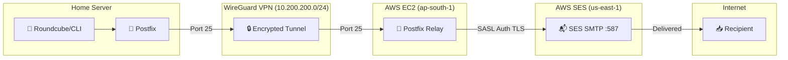
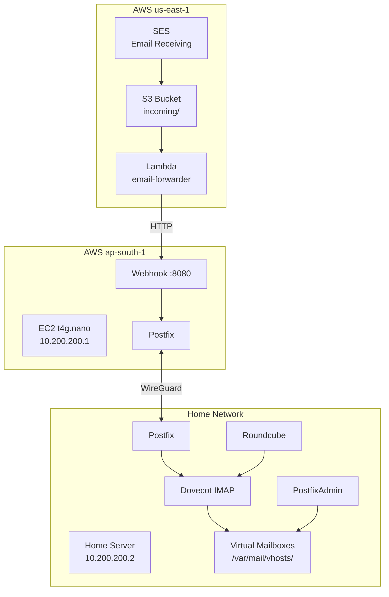

# AWS SES Business Email Server - Complete Setup Guide

> **A comprehensive guide for setting up a low-cost, self-hosted business email system using AWS SES, EC2 relay, and a home server.**

## Architecture Overview

### Inbound Email Flow

```mermaid
flowchart LR
    subgraph Internet
        A[📧 Sender]
    end
    
    subgraph AWS["AWS Cloud (us-east-1)"]
        B[📬 SES Inbound]
        C[🪣 S3 Bucket]
        D[⚡ Lambda]
    end
    
    subgraph EC2["AWS EC2 (ap-south-1)"]
        E[🔗 Webhook :8080]
        F[📮 Postfix]
    end
    
    subgraph VPN["WireGuard VPN (10.200.200.0/24)"]
        G[🔒 Encrypted Tunnel]
    end
    
    subgraph Home["Home Server"]
        H[📮 Postfix]
        I[📥 Dovecot]
        J[📁 Virtual Mailbox]
    end
    
    A -->|MX Record| B
    B -->|Store Email| C
    C -->|S3 Event| D
    D -->|HTTP POST| E
    E -->|Download & Inject| F
    F -->|Port 25| G
    G -->|Port 25| H
    H --> I
    I --> J
```



### Outbound Email Flow



### Component Diagram



## Cost Breakdown

| Service | Monthly Cost |
|---------|--------------|
| EC2 t4g.nano | ~$3 |
| SES | ~$0.10/1000 emails |
| S3 + Lambda | ~$0.01 |
| **Total** | **~$3-4/month** |

---

## Prerequisites

- AWS Account
- Domain name (e.g., `yoddhaindustries.com`)
- Home server (Ubuntu/Debian) with WireGuard
- Cloudflare or other DNS provider

---

# Phase 1: AWS SES Setup (us-east-1)

> **Important:** SES email receiving is only available in `us-east-1`, `us-west-2`, and `eu-west-1`. We use `us-east-1`.

## 1.1 Verify Domain

1. **AWS Console** → Switch to `us-east-1` region
2. **SES Console** → **Identities** → **Create Identity**
3. Select **Domain** → Enter your domain (e.g., `yoddhaindustries.com`)
4. Check **Use a custom MAIL FROM domain** → Enter `mail`
5. Enable **Easy DKIM**
6. Click **Create Identity**

## 1.2 Add DNS Records in Cloudflare

Add these records from SES:

| Type | Name | Value |
|------|------|-------|
| CNAME | (DKIM 1) | (from SES) |
| CNAME | (DKIM 2) | (from SES) |
| CNAME | (DKIM 3) | (from SES) |
| MX | `@` | `inbound-smtp.us-east-1.amazonaws.com` (Priority: 10) |
| MX | `mail` | `feedback-smtp.us-east-1.amazonses.com` (Priority: 10) |
| TXT | `mail` | `v=spf1 include:amazonses.com ~all` |
| TXT | `_dmarc` | `v=DMARC1; p=none; rua=mailto:admin@yourdomain.com` |

## 1.3 Create SMTP Credentials

1. **SES Console** → **SMTP Settings** → **Create SMTP Credentials**
2. Download and save the credentials securely
3. Note: These are different from IAM credentials!

---

# Phase 2: S3 Bucket Setup (us-east-1)

## 2.1 Create Bucket

1. **S3 Console** (us-east-1) → **Create Bucket**
2. **Name:** `yourdomain-inbound-emails`
3. **Region:** US East (N. Virginia) us-east-1
4. **Create Bucket**

## 2.2 Add Bucket Policy

Go to **Permissions** → **Bucket Policy**:

```json
{
    "Version": "2012-10-17",
    "Statement": [
        {
            "Effect": "Allow",
            "Principal": {
                "Service": "ses.amazonaws.com"
            },
            "Action": ["s3:PutObject", "s3:PutObjectAcl"],
            "Resource": "arn:aws:s3:::yourdomain-inbound-emails/*"
        }
    ]
}
```

## 2.3 Add Lifecycle Rule

1. **Management** → **Create Lifecycle Rule**
2. **Name:** `delete-old-emails`
3. **Prefix:** `incoming/`
4. **Actions:** Expire current versions after **1 day**

---

# Phase 3: SES Receipt Rules (us-east-1)

## 3.1 Create Rule Set

1. **SES Console** → **Email receiving** → **Rule sets**
2. **Create rule set** → Name: `default-rule-set`
3. Click **Set as active**

## 3.2 Create Receipt Rule

1. Click on your rule set → **Create rule**
2. **Name:** `store-to-s3`
3. **Recipient condition:** `yourdomain.com`
4. **Action:** Deliver to S3 bucket
   - Select your bucket
   - Prefix: `incoming/`
   - Create IAM role if prompted (with S3 full access)
5. **Save rule set**

---

# Phase 4: EC2 Instance Setup (ap-south-1)

## 4.1 Launch Instance

1. **Switch to ap-south-1** (or your preferred region)
2. **EC2 Console** → **Launch Instance**
3. **Settings:**
   - **Name:** `email-relay`
   - **AMI:** Ubuntu 24.04 LTS (ARM64)
   - **Instance type:** `t4g.nano`
   - **Key pair:** Create or select existing

4. **Security Group Rules:**

| Port | Protocol | Source | Purpose |
|------|----------|--------|---------|
| 22 | TCP | Your IP | SSH |
| 25 | TCP | 10.200.200.0/24 | SMTP from home |
| 8080 | TCP | 0.0.0.0/0 | Lambda webhook |
| 51820 | UDP | 0.0.0.0/0 | WireGuard |

5. **Launch Instance**

## 4.2 Allocate Elastic IP

1. **EC2 Console** → **Elastic IPs** → **Allocate**
2. **Associate** with your instance
3. Note the Elastic IP for later

## 4.3 Attach IAM Role

1. **IAM Console** → **Roles** → **Create Role**
2. **Trusted entity:** AWS Service → EC2
3. **Permissions:** Attach `AmazonS3FullAccess`
4. **Name:** `EC2-S3-Access-Role`
5. **EC2 Console** → Instance → **Actions** → **Security** → **Modify IAM Role**
6. Select `EC2-S3-Access-Role`

---

# Phase 5: WireGuard VPN Setup

## 5.1 On EC2

```bash
# SSH into EC2
ssh -i your-key.pem ubuntu@<ELASTIC-IP>

# Install packages
sudo apt update && sudo apt upgrade -y
sudo apt install -y wireguard wireguard-tools postfix python3-pip python3-venv awscli libsasl2-modules

# Generate WireGuard keys
sudo su
cd /etc/wireguard
umask 077
wg genkey | tee ec2-private.key | wg pubkey > ec2-public.key

# Save public key (you'll need this for home server)
cat ec2-public.key

# Create WireGuard config
cat > /etc/wireguard/wg0.conf << 'EOF'
[Interface]
Address = 10.200.200.1/24
ListenPort = 51820
PrivateKey = <EC2_PRIVATE_KEY>

[Peer]
# Home Server
PublicKey = <HOME_SERVER_PUBLIC_KEY>
AllowedIPs = 10.200.200.2/32
PersistentKeepalive = 25
EOF

# Enable WireGuard
systemctl enable wg-quick@wg0
systemctl start wg-quick@wg0
```

## 5.2 On Home Server

```bash
# Install WireGuard
sudo apt install -y wireguard wireguard-tools

# Generate keys
sudo su
cd /etc/wireguard
umask 077
wg genkey | tee home-private.key | wg pubkey > home-public.key

# Create config
cat > /etc/wireguard/wg0.conf << 'EOF'
[Interface]
Address = 10.200.200.2/24
PrivateKey = <HOME_PRIVATE_KEY>

[Peer]
# EC2
PublicKey = <EC2_PUBLIC_KEY>
Endpoint = <EC2_ELASTIC_IP>:51820
AllowedIPs = 10.200.200.1/32
PersistentKeepalive = 25
EOF

# Enable WireGuard
systemctl enable wg-quick@wg0
systemctl start wg-quick@wg0

# Test connection
ping 10.200.200.1
```

---

# Phase 6: EC2 Postfix & Webhook Setup

## 6.1 Configure Postfix on EC2

```bash
# On EC2
sudo tee /etc/postfix/main.cf << 'EOF'
myhostname = mail.yourdomain.com
mydomain = yourdomain.com
myorigin = $mydomain
mydestination = localhost

inet_interfaces = all
inet_protocols = ipv4
mynetworks = 127.0.0.0/8, 10.200.200.0/24

# Relay to home server
transport_maps = hash:/etc/postfix/transport
relay_domains = yourdomain.com

# Security
smtpd_relay_restrictions = permit_mynetworks, reject_unauth_destination

# Outbound via SES SMTP
relayhost = [email-smtp.us-east-1.amazonaws.com]:587
smtp_sasl_auth_enable = yes
smtp_sasl_security_options = noanonymous
smtp_sasl_password_maps = hash:/etc/postfix/sasl_passwd
smtp_use_tls = yes
smtp_tls_security_level = encrypt
smtp_tls_CAfile = /etc/ssl/certs/ca-certificates.crt

# Don't require TLS for internal VPN
smtp_tls_security_level = may
EOF

# Create transport map
sudo tee /etc/postfix/transport << 'EOF'
yourdomain.com smtp:[10.200.200.2]:25
.yourdomain.com smtp:[10.200.200.2]:25
EOF

# Create SASL password file
sudo tee /etc/postfix/sasl_passwd << 'EOF'
[email-smtp.us-east-1.amazonaws.com]:587 YOUR_SES_SMTP_USERNAME:YOUR_SES_SMTP_PASSWORD
EOF

sudo chmod 600 /etc/postfix/sasl_passwd
sudo postmap /etc/postfix/sasl_passwd
sudo postmap /etc/postfix/transport

sudo systemctl restart postfix
```

## 6.2 Setup Email Webhook on EC2

```bash
# Create webhook directory
sudo mkdir -p /opt/email-webhook
cd /opt/email-webhook

# Create virtual environment
sudo python3 -m venv venv
sudo ./venv/bin/pip install flask boto3 gunicorn

# Create webhook app
sudo tee /opt/email-webhook/app.py << 'EOF'
from flask import Flask, request, jsonify
import boto3
import subprocess
import logging

app = Flask(__name__)
logging.basicConfig(level=logging.INFO)
logger = logging.getLogger(__name__)

@app.route('/email-received', methods=['POST'])
def email_received():
    data = request.get_json()
    bucket = data.get('bucket')
    key = data.get('key')
    
    logger.info(f"Processing: s3://{bucket}/{key}")
    
    try:
        s3 = boto3.client('s3', region_name='us-east-1')
        email_obj = s3.get_object(Bucket=bucket, Key=key)
        email_content = email_obj['Body'].read()
        
        process = subprocess.Popen(
            ['/usr/sbin/sendmail', '-t', '-oi'],
            stdin=subprocess.PIPE,
            stdout=subprocess.PIPE,
            stderr=subprocess.PIPE
        )
        stdout, stderr = process.communicate(input=email_content)
        
        if process.returncode == 0:
            logger.info(f"Forwarded: {key}")
            s3.delete_object(Bucket=bucket, Key=key)
            return jsonify({'status': 'success'}), 200
        else:
            logger.error(f"Failed: {stderr.decode()}")
            return jsonify({'error': stderr.decode()}), 500
    except Exception as e:
        logger.error(f"Error: {str(e)}")
        return jsonify({'error': str(e)}), 500

@app.route('/health', methods=['GET'])
def health():
    return jsonify({'status': 'healthy'}), 200

if __name__ == '__main__':
    app.run(host='0.0.0.0', port=8080)
EOF

# Create systemd service
sudo tee /etc/systemd/system/email-webhook.service << 'EOF'
[Unit]
Description=Email Webhook
After=network.target

[Service]
Type=simple
User=ubuntu
WorkingDirectory=/opt/email-webhook
ExecStart=/opt/email-webhook/venv/bin/gunicorn --bind 0.0.0.0:8080 --workers 2 app:app
Restart=always

[Install]
WantedBy=multi-user.target
EOF

sudo systemctl daemon-reload
sudo systemctl enable email-webhook
sudo systemctl start email-webhook
```

---

# Phase 7: Lambda Function (us-east-1)

## 7.1 Create Lambda Function

1. **Lambda Console** (us-east-1) → **Create function**
2. **Name:** `email-forwarder`
3. **Runtime:** Python 3.11
4. **Architecture:** arm64

## 7.2 Add Function Code

```python
import json
import urllib.request
import os

EC2_WEBHOOK_URL = os.environ.get('EC2_WEBHOOK_URL')

def lambda_handler(event, context):
    for record in event.get('Records', []):
        bucket = record['s3']['bucket']['name']
        key = record['s3']['object']['key']
        
        print(f"New email: s3://{bucket}/{key}")
        
        payload = json.dumps({'bucket': bucket, 'key': key}).encode()
        
        try:
            req = urllib.request.Request(
                EC2_WEBHOOK_URL,
                data=payload,
                headers={'Content-Type': 'application/json'},
                method='POST'
            )
            with urllib.request.urlopen(req, timeout=30) as resp:
                print(f"Response: {resp.read().decode()}")
        except Exception as e:
            print(f"Error: {e}")
    
    return {'statusCode': 200}
```

## 7.3 Configure Lambda

1. **Configuration** → **Environment variables**:
   - `EC2_WEBHOOK_URL`: `http://<EC2_ELASTIC_IP>:8080/email-received`

2. **Configuration** → **General**: Set timeout to **30 seconds**

3. **Configuration** → **Permissions**: Attach `AmazonS3ReadOnlyAccess` to the role

## 7.4 Add S3 Trigger

1. **Add trigger** → **S3**
2. **Bucket:** Your email bucket
3. **Event type:** All object create events
4. **Prefix:** `incoming/`
5. **Add**

---

# Phase 8: Home Server Mail Setup

## 8.1 Install Packages

```bash
sudo apt update
sudo apt install -y postfix dovecot-core dovecot-imapd dovecot-sqlite \
    roundcube roundcube-plugins postfixadmin php-sqlite3 apache2

# During Postfix install:
# - Type: Internet Site
# - Mail name: yourdomain.com
```

## 8.2 Configure Postfix

```bash
sudo tee /etc/postfix/main.cf << 'EOF'
myhostname = mail.yourdomain.com
mydomain = yourdomain.com
myorigin = $mydomain
mydestination = localhost

inet_interfaces = all
inet_protocols = ipv4
mynetworks = 127.0.0.0/8, 10.200.200.0/24

# Security
smtpd_relay_restrictions = permit_mynetworks, reject_unauth_destination

# Virtual mailbox settings
virtual_mailbox_domains = yourdomain.com
virtual_mailbox_base = /var/mail/vhosts
virtual_mailbox_maps = sqlite:/etc/postfix/sqlite-virtual-mailbox-maps.cf
virtual_uid_maps = static:5000
virtual_gid_maps = static:5000

# Relay outbound via EC2
relayhost = [10.200.200.1]:25

# TLS
smtp_tls_security_level = may
EOF

# Create virtual mailbox map
sudo tee /etc/postfix/sqlite-virtual-mailbox-maps.cf << 'EOF'
dbpath = /var/lib/postfixadmin/postfixadmin.db
query = SELECT maildir FROM mailbox WHERE username='%s' AND active = '1'
EOF

# Install Postfix SQLite support
sudo apt install -y postfix-sqlite

# Create vmail user
sudo groupadd -g 5000 vmail
sudo useradd -u 5000 -g vmail -s /usr/sbin/nologin -d /var/mail/vhosts vmail
sudo mkdir -p /var/mail/vhosts/yourdomain.com
sudo chown -R vmail:vmail /var/mail/vhosts

sudo systemctl restart postfix
```

## 8.3 Configure Dovecot

```bash
# SQL config
sudo tee /etc/dovecot/dovecot-sql.conf.ext << 'EOF'
driver = sqlite
connect = /var/lib/postfixadmin/postfixadmin.db

password_query = SELECT username AS user, password FROM mailbox WHERE username = '%u' AND active = '1'
user_query = SELECT '/var/mail/vhosts/%d/%n' AS home, 'maildir:/var/mail/vhosts/%d/%n' AS mail, 5000 AS uid, 5000 AS gid FROM mailbox WHERE username = '%u'
EOF

# Auth config
sudo tee /etc/dovecot/conf.d/10-auth.conf << 'EOF'
disable_plaintext_auth = no
auth_mechanisms = plain login
!include auth-sql.conf.ext
EOF

# SQL auth extension
sudo tee /etc/dovecot/conf.d/auth-sql.conf.ext << 'EOF'
passdb {
  driver = sql
  args = /etc/dovecot/dovecot-sql.conf.ext
}

userdb {
  driver = sql
  args = /etc/dovecot/dovecot-sql.conf.ext
}
EOF

sudo chmod 640 /etc/dovecot/dovecot-sql.conf.ext
sudo chown root:dovecot /etc/dovecot/dovecot-sql.conf.ext

sudo systemctl restart dovecot
```

## 8.4 Configure PostfixAdmin

```bash
# Create config
sudo tee /etc/postfixadmin/config.local.php << 'EOF'
<?php
$CONF['database_type'] = 'sqlite';
$CONF['database_name'] = '/var/lib/postfixadmin/postfixadmin.db';
$CONF['configured'] = true;
$CONF['setup_password'] = '';
$CONF['default_aliases'] = array();
$CONF['domain_path'] = 'YES';
$CONF['domain_in_mailbox'] = 'NO';
?>
EOF

# Create database directory
sudo mkdir -p /var/lib/postfixadmin
sudo chown -R www-data:www-data /var/lib/postfixadmin
sudo chmod 755 /var/lib/postfixadmin

# Enable Apache config
sudo a2enconf postfixadmin
sudo systemctl reload apache2
```

Access `http://your-server-ip/postfixadmin/setup.php` to complete setup.

## 8.5 Configure Roundcube

```bash
# Edit config
sudo nano /etc/roundcube/config.inc.php

# Set these values:
$config['smtp_host'] = 'localhost:25';
$config['smtp_user'] = '';
$config['smtp_pass'] = '';

# Enable Apache config
sudo a2enconf roundcube
sudo systemctl reload apache2
```

Access `http://your-server-ip/roundcube` for webmail.

---

# Phase 9: Maintenance Setup

## 9.1 Health Check Script (Both Servers)

```bash
# On Home Server
sudo tee /usr/local/bin/mail-health-check.sh << 'EOF'
#!/bin/bash
LOG="/var/log/mail-health.log"
DATE=$(date '+%Y-%m-%d %H:%M:%S')

for service in postfix dovecot apache2; do
    if ! systemctl is-active --quiet $service; then
        echo "$DATE - $service is DOWN, restarting..." >> $LOG
        systemctl restart $service
    fi
done

if ! ping -c 1 10.200.200.1 &>/dev/null; then
    echo "$DATE - WireGuard DOWN, restarting..." >> $LOG
    systemctl restart wg-quick@wg0
fi
EOF

sudo chmod +x /usr/local/bin/mail-health-check.sh
echo "*/5 * * * * root /usr/local/bin/mail-health-check.sh" | sudo tee /etc/cron.d/mail-health
```

---

# Quick Reference Commands

| Task | Command |
|------|---------|
| Check mail queue | `mailq` |
| Flush mail queue | `sudo postqueue -f` |
| View mail logs | `sudo tail -f /var/log/mail.log` |
| Check WireGuard | `sudo wg show` |
| Restart Postfix | `sudo systemctl restart postfix` |
| Restart Dovecot | `sudo systemctl restart dovecot` |
| Check webhook | `sudo systemctl status email-webhook` |

---

# Troubleshooting

## Email not receiving
1. Check MX record: `dig MX yourdomain.com +short`
2. Check S3 for emails
3. Check Lambda logs in CloudWatch
4. Check EC2 webhook: `sudo journalctl -u email-webhook -f`

## Email not sending
1. Check mail queue: `mailq`
2. Check mail logs: `sudo tail -f /var/log/mail.log`
3. Verify SES credentials
4. Check SES sandbox status

## TLS errors
- Add `smtp_tls_security_level = may` to Postfix main.cf

---

**Setup Complete!** 🎉
