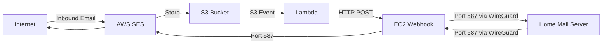

# AWS SES Business Email Setup Guide

Complete guide to set up business email using AWS SES, EC2 relay, and home mail server connected via WireGuard VPN.

> [!IMPORTANT]
> **AWS blocks port 25 on EC2 instances** to prevent spam. This guide uses:
> - **Inbound:** SES stores emails in S3 → Lambda triggers EC2 instantly → Forward to home server
> - **Outbound:** Home server → EC2 (port 587) → SES SMTP (port 587) → Internet

## Estimated Monthly Cost

| Service | Cost | Notes |
|---------|------|-------|
| SES | ~$0.10 | Per 1000 emails sent |
| S3 | ~$0.01 | Auto-deleted after processing |
| Lambda | $0.00 | Free tier: 1M requests/month |
| EC2 t4g.nano | ~$3.00 | Cheapest instance (ARM) |
| **Total** | **~$3-4/month** | For typical business usage |

## Architecture Overview



**Inbound Flow (Instant):** Internet → SES → S3 → Lambda → EC2 Webhook → WireGuard → Home Server  
**Outbound Flow:** Home Server → WireGuard → EC2 → SES (port 587) → Internet

---

## Prerequisites

- [ ] AWS Account with billing enabled
- [ ] Domain name (e.g., yourbusiness.com)
- [ ] Home server with Ubuntu/Debian (or similar)
- [ ] Static IP or dynamic DNS for home server (for VPN)
- [ ] Basic knowledge of Linux command line

---

## Phase 1: AWS SES Domain Setup

### Step 1.1: Verify Your Domain in SES

1. **Login to AWS Console** → Navigate to **Amazon SES**
2. **Select Region** (choose closest to you, e.g., `us-east-1`, `eu-west-1`)
3. Go to **Configuration** → **Verified Identities** → **Create Identity**
4. Select **Domain** and enter your domain name
5. Choose **Easy DKIM** (recommended)
6. Click **Create Identity**

### Step 1.2: Add DNS Records

AWS will provide DNS records to add to your domain registrar:

| Type | Name | Value |
|------|------|-------|
| TXT | _amazonses.yourbusiness.com | (verification token) |
| CNAME | xxx._domainkey.yourbusiness.com | xxx.dkim.amazonses.com |
| CNAME | yyy._domainkey.yourbusiness.com | yyy.dkim.amazonses.com |
| CNAME | zzz._domainkey.yourbusiness.com | zzz.dkim.amazonses.com |

**Add these records:**
```
# Example for Cloudflare/your DNS provider
Type: TXT
Name: _amazonses
Value: <provided-token>

Type: CNAME
Name: <selector1>._domainkey
Value: <selector1>.dkim.amazonses.com

# Repeat for all 3 DKIM records
```

### Step 1.3: Add MX Record

Point your domain's MX record to SES inbound endpoint:

```
Type: MX
Name: @
Priority: 10
Value: inbound-smtp.<region>.amazonaws.com
```

Replace `<region>` with your SES region (e.g., `us-east-1`).

### Step 1.4: Request Production Access

1. In SES Console → **Account Dashboard**
2. Click **Request production access**
3. Fill out the form:
   - **Mail type:** Transactional
   - **Website URL:** Your business website
   - **Use case description:** Business email for company communications
   - **Compliance:** Confirm you'll handle bounces/complaints
4. Submit and wait for approval (usually 24-48 hours)

---

## Phase 2: EC2 Instance Setup

### Step 2.1: Launch EC2 Instance

1. **Go to EC2 Console** → **Launch Instance**
2. **Configuration:**
   - **Name:** `email-relay-server`
   - **AMI:** Ubuntu Server 24.04 LTS (**ARM64** - for t4g)
   - **Instance Type:** `t4g.nano` (~$3/month, cheapest)
   - **Key Pair:** Create new or use existing
   - **Network Settings:**
     - Auto-assign public IP: **Yes**
     - Create security group with these rules:

| Type | Protocol | Port | Source | Description |
|------|----------|------|--------|-------------|
| SSH | TCP | 22 | Your IP | SSH access |
| Custom TCP | TCP | 587 | 10.200.200.0/24 | Mail submission from home server via VPN |
| Custom UDP | UDP | 51820 | 0.0.0.0/0 | WireGuard VPN (use Your Home IP if static) |

3. **Storage:** 8 GB (default is fine)
4. **Launch Instance**

### Step 2.2: Allocate Elastic IP

1. **EC2 Console** → **Elastic IPs** → **Allocate Elastic IP**
2. **Associate** the Elastic IP with your `email-relay-server` instance
3. **Note down this IP** - you'll need it for DNS and WireGuard

### Step 2.3: Connect to EC2 Instance

```bash
ssh -i your-key.pem ubuntu@<elastic-ip>
```

### Step 2.4: Update System

```bash
sudo apt update && sudo apt upgrade -y
sudo apt install -y postfix postfix-pcre wireguard wireguard-tools net-tools
```

When prompted during Postfix installation:
- **General type:** Internet Site
- **System mail name:** yourbusiness.com

---

## Phase 3: WireGuard VPN Setup

### Step 3.1: Generate Keys on EC2

```bash
# On EC2 instance
cd /etc/wireguard
sudo su
umask 077

# Generate EC2 keys
wg genkey | tee ec2-private.key | wg pubkey > ec2-public.key

# Display keys (save these)
echo "EC2 Private Key:"
cat ec2-private.key
echo "EC2 Public Key:"
cat ec2-public.key
```

### Step 3.2: Generate Keys on Home Server

```bash
# On your home server
sudo apt install -y wireguard wireguard-tools
cd /etc/wireguard
sudo su
umask 077

# Generate home server keys
wg genkey | tee home-private.key | wg pubkey > home-public.key

# Display keys (save these)
echo "Home Private Key:"
cat home-private.key
echo "Home Public Key:"
cat home-public.key
```

### Step 3.3: Configure WireGuard on EC2

Create `/etc/wireguard/wg0.conf` on EC2:

```ini
[Interface]
Address = 10.200.200.1/24
ListenPort = 51820
PrivateKey = <EC2-PRIVATE-KEY>

# Enable IP forwarding
PostUp = sysctl -w net.ipv4.ip_forward=1
PostDown = sysctl -w net.ipv4.ip_forward=0

[Peer]
# Home Server
PublicKey = <HOME-PUBLIC-KEY>
AllowedIPs = 10.200.200.2/32
PersistentKeepalive = 25
```

**Enable and start WireGuard:**

```bash
sudo systemctl enable wg-quick@wg0
sudo systemctl start wg-quick@wg0
sudo systemctl status wg-quick@wg0
```

### Step 3.4: Configure WireGuard on Home Server

Create `/etc/wireguard/wg0.conf` on home server:

```ini
[Interface]
Address = 10.200.200.2/24
PrivateKey = <HOME-PRIVATE-KEY>

# Auto-reconnect script
PostUp = /etc/wireguard/check-connection.sh

[Peer]
# EC2 Server
PublicKey = <EC2-PUBLIC-KEY>
Endpoint = <EC2-ELASTIC-IP>:51820
AllowedIPs = 10.200.200.1/32
PersistentKeepalive = 25
```

**Enable and start WireGuard:**

```bash
sudo systemctl enable wg-quick@wg0
sudo systemctl start wg-quick@wg0
sudo systemctl status wg-quick@wg0
```

### Step 3.5: Test VPN Connection

```bash
# From EC2, ping home server
ping 10.200.200.2

# From home server, ping EC2
ping 10.200.200.1
```

Both should respond successfully.

---

## Phase 4: Postfix Configuration on EC2

### Step 4.1: Configure Postfix as Relay

Edit `/etc/postfix/main.cf` on EC2:

```bash
sudo nano /etc/postfix/main.cf
```

**Add/modify these settings:**

```conf
# Basic settings
myhostname = mail.yourbusiness.com
mydomain = yourbusiness.com
myorigin = $mydomain
mydestination = localhost

# Network settings
inet_interfaces = all
inet_protocols = ipv4

# Relay settings - accept from SES and home server
mynetworks = 127.0.0.0/8, 10.200.200.0/24, <SES-IP-RANGES>
relay_domains = $mydomain

# Forward incoming mail to home server via WireGuard
transport_maps = hash:/etc/postfix/transport

# Outbound via SES SMTP
relayhost = [email-smtp.<region>.amazonaws.com]:587
smtp_sasl_auth_enable = yes
smtp_sasl_security_options = noanonymous
smtp_sasl_password_maps = hash:/etc/postfix/sasl_passwd
smtp_use_tls = yes
smtp_tls_security_level = encrypt
smtp_tls_note_starttls_offer = yes

# Size limits
message_size_limit = 40960000
```

> [!IMPORTANT]
> Replace `<region>` with your SES region (e.g., `us-east-1`)

### Step 4.2: Get SES SMTP Credentials

1. **SES Console** → **SMTP Settings** → **Create SMTP Credentials**
2. Download and save the credentials (username and password)

### Step 4.3: Configure SES SMTP Authentication

Create `/etc/postfix/sasl_passwd`:

```bash
sudo nano /etc/postfix/sasl_passwd
```

Add:

```
[email-smtp.<region>.amazonaws.com]:587 SMTP_USERNAME:SMTP_PASSWORD
```

**Secure and hash the file:**

```bash
sudo chmod 600 /etc/postfix/sasl_passwd
sudo postmap /etc/postfix/sasl_passwd
```

### Step 4.4: Configure Transport Map

Create `/etc/postfix/transport`:

```bash
sudo nano /etc/postfix/transport
```

Add:

```
yourbusiness.com smtp:[10.200.200.2]:587
.yourbusiness.com smtp:[10.200.200.2]:587
```

**Hash the transport file:**

```bash
sudo postmap /etc/postfix/transport
```

### Step 4.5: Restart Postfix

```bash
sudo systemctl restart postfix
sudo systemctl status postfix
```

---

## Phase 5: Home Mail Server Setup

### Step 5.1: Install Mail Server Software

I recommend **Mail-in-a-Box** for easy setup, or manual **Postfix + Dovecot**.

#### Option A: Mail-in-a-Box (Recommended for beginners)

```bash
# On home server
curl -s https://mailinabox.email/setup.sh | sudo bash
```

Follow the interactive setup:
- **Email address:** admin@yourbusiness.com
- **Hostname:** mail.yourbusiness.com (use internal hostname)
- **Country/Timezone:** Your location

#### Option B: Manual Postfix + Dovecot

```bash
sudo apt install -y postfix dovecot-core dovecot-imapd dovecot-pop3d
```

**Configure Postfix** (`/etc/postfix/main.cf`):

```conf
myhostname = mail.local.yourbusiness.com
mydomain = yourbusiness.com
myorigin = $mydomain
mydestination = $mydomain, localhost
mynetworks = 127.0.0.0/8, 10.200.200.0/24
inet_interfaces = all

# Mailbox settings
home_mailbox = Maildir/
mailbox_command =

# SMTP relay via EC2 for outbound
relayhost = [10.200.200.1]:587
```

### Step 5.2: Configure Outbound Relay

Your home server should send all outbound mail to EC2:

In `/etc/postfix/main.cf`:

```conf
relayhost = [10.200.200.1]:587
```

Restart Postfix:

```bash
sudo systemctl restart postfix
```

---

## Phase 6: S3 Bucket & SES Receipt Rules

> [!NOTE]
> Since EC2 can't receive on port 25, SES will store emails in S3, and EC2 will fetch them.

### Step 6.1: Create S3 Bucket for Emails

1. **S3 Console** → **Create Bucket**
2. **Configuration:**
   - **Bucket name:** `yourbusiness-inbound-emails` (must be globally unique)
   - **Region:** Same as your SES region
   - **Block Public Access:** Keep all enabled (default)
3. **Create Bucket**

### Step 6.2: Configure S3 Bucket Policy

Add bucket policy to allow SES to write emails:

```json
{
    "Version": "2012-10-17",
    "Statement": [
        {
            "Sid": "AllowSESPuts",
            "Effect": "Allow",
            "Principal": {
                "Service": "ses.amazonaws.com"
            },
            "Action": "s3:PutObject",
            "Resource": "arn:aws:s3:::yourbusiness-inbound-emails/*",
            "Condition": {
                "StringEquals": {
                    "AWS:SourceAccount": "<YOUR-AWS-ACCOUNT-ID>"
                }
            }
        }
    ]
}
```

### Step 6.3: Create Receipt Rule Set

1. **SES Console** → **Email Receiving** → **Rule Sets**
2. **Create Rule Set** → Name: `default-rule-set`
3. **Set as Active Rule Set**

### Step 6.4: Create Receipt Rule

1. **Create Rule** in your rule set
2. **Recipients:** Add your domain (e.g., `yourbusiness.com`)
3. **Actions:**
   - **Action 1:** Deliver to S3 bucket
     - S3 bucket: `yourbusiness-inbound-emails`
     - Object key prefix: `incoming/` (optional)
4. **Rule name:** `store-to-s3`
5. **Create Rule**

### Step 6.5: Add S3 Lifecycle Rule (Cost Optimization)

Auto-delete processed emails to minimize storage costs:

1. **S3 Console** → Your bucket → **Management** → **Lifecycle Rules**
2. **Create Lifecycle Rule:**
   - **Name:** `delete-old-emails`
   - **Prefix:** `incoming/`
   - **Transitions:** None
   - **Expiration:** Delete after **1 day**
3. **Create Rule**

> [!NOTE]
> Emails are deleted from S3 immediately after forwarding. This is a safety net for failed forwards.

### Step 6.6: Create IAM Role for EC2

EC2 needs permissions to read from S3 and delete processed emails:

1. **IAM Console** → **Roles** → **Create Role**
2. **Trusted entity:** AWS Service → EC2
3. **Create policy** with this JSON:

```json
{
    "Version": "2012-10-17",
    "Statement": [
        {
            "Effect": "Allow",
            "Action": [
                "s3:GetObject",
                "s3:DeleteObject",
                "s3:ListBucket"
            ],
            "Resource": [
                "arn:aws:s3:::yourbusiness-inbound-emails",
                "arn:aws:s3:::yourbusiness-inbound-emails/*"
            ]
        }
    ]
}
```

4. **Attach policy** to role, name it: `email-relay-s3-access`
5. **EC2 Console** → Select your instance → **Actions** → **Security** → **Modify IAM Role**
6. **Attach** the `email-relay-s3-access` role

### Step 6.7: Setup Real-Time Email Forwarding (Lambda + S3 Events)

> [!IMPORTANT]
> This uses **S3 Event Notifications + Lambda** for **instant** email delivery (no polling delay).

#### Architecture for Real-Time:
```
SES → S3 (store) → S3 Event → Lambda → HTTP POST to EC2 → Forward to Home Server
```

### Step 6.8: Create Lambda Function

1. **Lambda Console** → **Create Function**
2. **Configuration:**
   - **Function name:** `email-forwarder`
   - **Runtime:** Python 3.11
   - **Architecture:** arm64 (cheaper)
3. **Create Function**

**Add this code to the Lambda function:**

```python
import boto3
import json
import urllib.request
import urllib.error
import os

# Configuration - Set these in Lambda Environment Variables
EC2_WEBHOOK_URL = os.environ.get('EC2_WEBHOOK_URL', 'http://YOUR_EC2_IP:8080/email-received')

def lambda_handler(event, context):
    """
    Triggered by S3 event when new email arrives.
    Notifies EC2 to fetch and forward the email.
    """
    
    for record in event.get('Records', []):
        bucket = record['s3']['bucket']['name']
        key = record['s3']['object']['key']
        
        print(f"New email received: s3://{bucket}/{key}")
        
        # Notify EC2 to fetch this email
        payload = json.dumps({
            'bucket': bucket,
            'key': key
        }).encode('utf-8')
        
        try:
            req = urllib.request.Request(
                EC2_WEBHOOK_URL,
                data=payload,
                headers={'Content-Type': 'application/json'},
                method='POST'
            )
            
            with urllib.request.urlopen(req, timeout=30) as response:
                result = response.read().decode('utf-8')
                print(f"EC2 response: {result}")
                
        except urllib.error.URLError as e:
            print(f"Failed to notify EC2: {e}")
            # Don't raise - email stays in S3 for retry
            
    return {'statusCode': 200, 'body': 'Processed'}
```

4. **Configuration** → **Environment Variables** → Add:
   - **Key:** `EC2_WEBHOOK_URL`
   - **Value:** `http://<EC2-ELASTIC-IP>:8080/email-received`

5. **Configuration** → **General Configuration** → Set timeout to **30 seconds**

### Step 6.9: Add Lambda Permissions for S3

1. **Lambda Console** → Your function → **Configuration** → **Permissions**
2. Click on the **Role name** to open IAM
3. **Attach Policy** → **AmazonS3ReadOnlyAccess**

### Step 6.10: Configure S3 Event Notification

1. **S3 Console** → Your bucket (`yourbusiness-inbound-emails`)
2. **Properties** → **Event Notifications** → **Create Event Notification**
3. **Configuration:**
   - **Event name:** `trigger-email-forwarder`
   - **Prefix:** `incoming/` (same as SES rule)
   - **Event types:** ✅ `s3:ObjectCreated:*`
   - **Destination:** Lambda function → Select `email-forwarder`
4. **Save Changes**

### Step 6.11: Setup Webhook Receiver on EC2

Install Flask for the webhook receiver:

```bash
# On EC2
sudo apt install -y python3-pip python3-venv
sudo mkdir -p /opt/email-webhook
cd /opt/email-webhook
sudo python3 -m venv venv
sudo ./venv/bin/pip install flask boto3 gunicorn
```

Create `/opt/email-webhook/app.py`:

```python
#!/usr/bin/env python3
"""
Email Webhook Receiver - Receives notifications from Lambda and forwards emails
"""

from flask import Flask, request, jsonify
import boto3
import subprocess
import logging
import os

app = Flask(__name__)

# Configuration
HOME_SERVER = '10.200.200.2'
HOME_SERVER_PORT = '587'

# Setup logging
logging.basicConfig(
    level=logging.INFO,
    format='%(asctime)s - %(levelname)s - %(message)s'
)
logger = logging.getLogger(__name__)

@app.route('/email-received', methods=['POST'])
def email_received():
    """Handle incoming email notification from Lambda"""
    
    data = request.get_json()
    bucket = data.get('bucket')
    key = data.get('key')
    
    if not bucket or not key:
        return jsonify({'error': 'Missing bucket or key'}), 400
    
    logger.info(f"Processing email: s3://{bucket}/{key}")
    
    try:
        # Download from S3
        s3 = boto3.client('s3')
        email_obj = s3.get_object(Bucket=bucket, Key=key)
        email_content = email_obj['Body'].read()
        
        # Forward to home server via Postfix
        process = subprocess.Popen(
            ['/usr/sbin/sendmail', '-t', '-oi'],
            stdin=subprocess.PIPE,
            stdout=subprocess.PIPE,
            stderr=subprocess.PIPE
        )
        stdout, stderr = process.communicate(input=email_content)
        
        if process.returncode == 0:
            logger.info(f"Successfully forwarded: {key}")
            # Delete from S3
            s3.delete_object(Bucket=bucket, Key=key)
            logger.info(f"Deleted from S3: {key}")
            return jsonify({'status': 'forwarded', 'key': key}), 200
        else:
            error_msg = stderr.decode() if stderr else 'Unknown error'
            logger.error(f"Sendmail failed: {error_msg}")
            return jsonify({'error': error_msg}), 500
            
    except Exception as e:
        logger.error(f"Error processing email: {str(e)}")
        return jsonify({'error': str(e)}), 500

@app.route('/health', methods=['GET'])
def health():
    """Health check endpoint"""
    return jsonify({'status': 'healthy'}), 200

if __name__ == '__main__':
    app.run(host='0.0.0.0', port=8080)
```

### Step 6.12: Create Systemd Service for Webhook

Create `/etc/systemd/system/email-webhook.service`:

```ini
[Unit]
Description=Email Webhook Receiver
After=network.target

[Service]
Type=simple
User=ubuntu
WorkingDirectory=/opt/email-webhook
ExecStart=/opt/email-webhook/venv/bin/gunicorn --bind 0.0.0.0:8080 --workers 2 app:app
Restart=always
RestartSec=5

[Install]
WantedBy=multi-user.target
```

**Enable and start the service:**

```bash
sudo systemctl daemon-reload
sudo systemctl enable email-webhook
sudo systemctl start email-webhook
sudo systemctl status email-webhook
```

### Step 6.13: Update EC2 Security Group

Add rule to allow Lambda to reach EC2:

| Type | Protocol | Port | Source | Description |
|------|----------|------|--------|-------------|
| Custom TCP | TCP | 8080 | 0.0.0.0/0 | Webhook from Lambda |

> [!TIP]
> For better security, restrict port 8080 to **AWS Lambda IP ranges** for your region.

### Step 6.14: Test Real-Time Flow

```bash
# Monitor webhook logs on EC2
sudo journalctl -u email-webhook -f

# In another terminal, monitor mail logs
sudo tail -f /var/log/mail.log
```

Send a test email to your domain - it should arrive within **seconds**!

---

## Phase 7: Testing

### Step 7.1: Test Inbound Email

Send a test email to `test@yourbusiness.com`:

```bash
# Check S3 for incoming emails
aws s3 ls s3://yourbusiness-inbound-emails/incoming/

# Monitor fetcher logs on EC2
sudo tail -f /var/log/email-fetcher.log

# Monitor mail logs on home server
sudo tail -f /var/log/mail.log
```

**Expected flow (happens within seconds):**
1. Email arrives at SES
2. SES stores email in S3 bucket
3. S3 triggers Lambda function instantly
4. Lambda sends HTTP POST to EC2 webhook
5. EC2 fetches email from S3
6. EC2 forwards to home server via WireGuard (port 587)
7. Email delivered to mailbox on home server
8. Email deleted from S3

### Step 7.2: Test Outbound Email

From your home server, send a test email:

```bash
echo "Test email body" | mail -s "Test Subject" recipient@example.com
```

**Expected flow:**
1. Home server sends to EC2 via WireGuard
2. EC2 relays to SES
3. SES delivers to recipient

Check delivery in SES Console → **Sending Statistics**.

### Step 7.3: Verify SPF, DKIM, DMARC

Send a test email to a Gmail account, then check headers:

- **SPF:** Should show `PASS`
- **DKIM:** Should show `PASS`
- **DMARC:** Should show `PASS`

---

## Phase 8: Additional DNS Records

### SPF Record

Add TXT record:

```
Type: TXT
Name: @
Value: v=spf1 include:amazonses.com ~all
```

### DMARC Record

Add TXT record:

```
Type: TXT
Name: _dmarc
Value: v=DMARC1; p=quarantine; rua=mailto:dmarc@yourbusiness.com
```

---

## Monitoring & Maintenance

### Check VPN Status

```bash
# On either server
sudo wg show
```

### Monitor Email Logs

```bash
# EC2
sudo tail -f /var/log/mail.log

# Home Server
sudo tail -f /var/log/mail.log
```

### SES Monitoring

- **SES Console** → **Reputation Dashboard**
- Monitor bounce rate and complaint rate
- Set up CloudWatch alarms for anomalies

---

## Troubleshooting

### VPN Not Connecting

```bash
# Check WireGuard status
sudo systemctl status wg-quick@wg0

# Check firewall
sudo ufw status

# Restart WireGuard
sudo systemctl restart wg-quick@wg0
```

### Emails Not Arriving

```bash
# Check Postfix queue
mailq

# Check Postfix logs
sudo tail -100 /var/log/mail.log

# Test SMTP connection
telnet 10.200.200.2 25
```

### SES Sending Errors

- Check SMTP credentials in `/etc/postfix/sasl_passwd`
- Verify SES is in production mode
- Check sending limits in SES Console

---

## Security Checklist

- [ ] EC2 security group restricts SSH to your IP only
- [ ] WireGuard uses strong keys and restricted AllowedIPs
- [ ] Postfix configured to prevent open relay
- [ ] Fail2ban installed on both servers
- [ ] Regular system updates scheduled
- [ ] Email backups configured on home server
- [ ] TLS/SSL enabled for all mail transmission
- [ ] Strong passwords for mail accounts

---

## Next Steps

Once basic setup is working, you can add:

1. **Email queuing on EC2** for VPN downtime
2. **Monitoring scripts** for VPN health
3. **Automatic failover** mechanisms
4. **Webmail interface** (Roundcube, Rainloop)
5. **Spam filtering** (SpamAssassin, rspamd)
6. **Antivirus scanning** (ClamAV)

---

## Quick Reference

### Important IPs
- **EC2 Elastic IP:** `<your-ec2-ip>`
- **EC2 VPN IP:** `10.200.200.1`
- **Home Server VPN IP:** `10.200.200.2`

### Important Files
- **EC2 Postfix Config:** `/etc/postfix/main.cf`
- **EC2 WireGuard Config:** `/etc/wireguard/wg0.conf`
- **Home Postfix Config:** `/etc/postfix/main.cf`
- **Home WireGuard Config:** `/etc/wireguard/wg0.conf`

### Useful Commands
```bash
# Restart Postfix
sudo systemctl restart postfix

# Restart WireGuard
sudo systemctl restart wg-quick@wg0

# Check mail queue
mailq

# View mail logs
sudo tail -f /var/log/mail.log

# Test SMTP
telnet localhost 25
```
